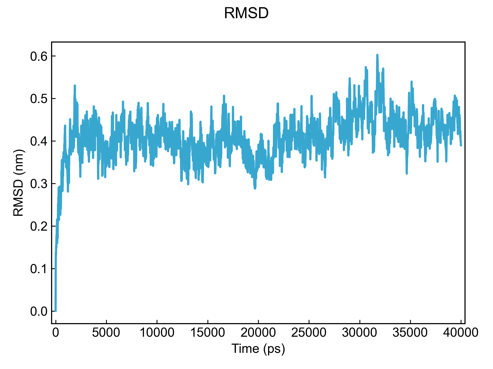
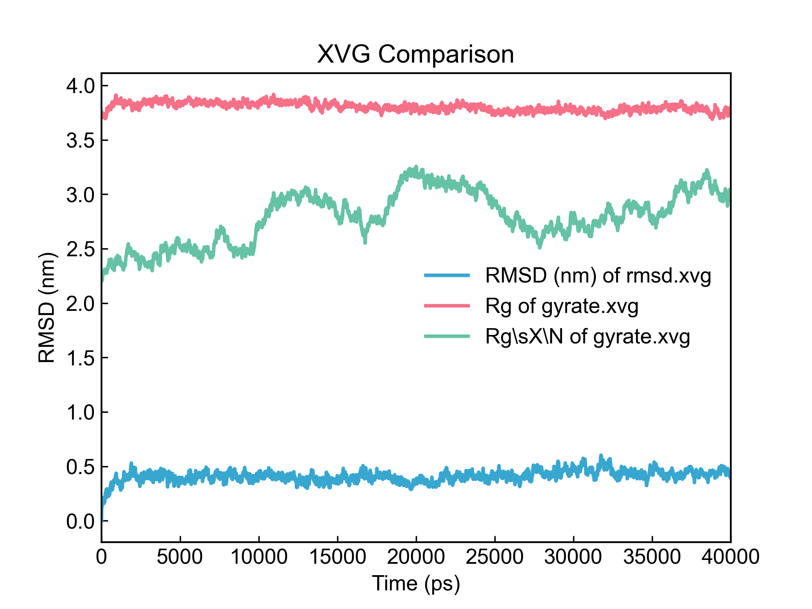
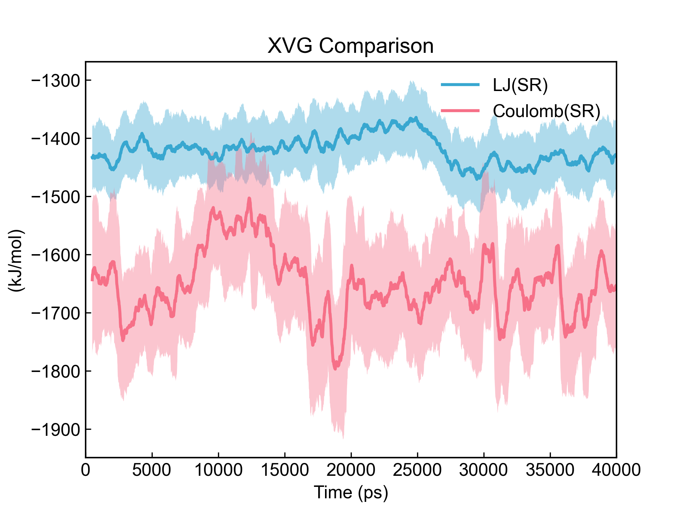
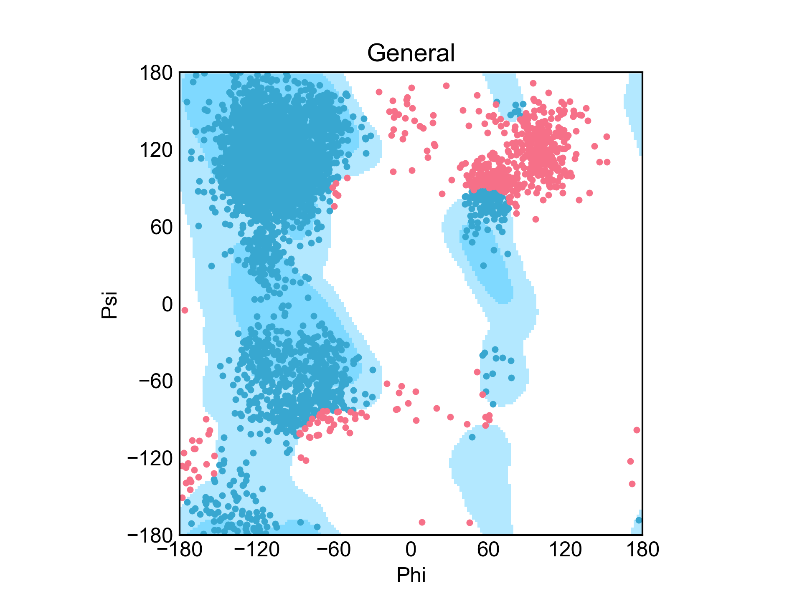
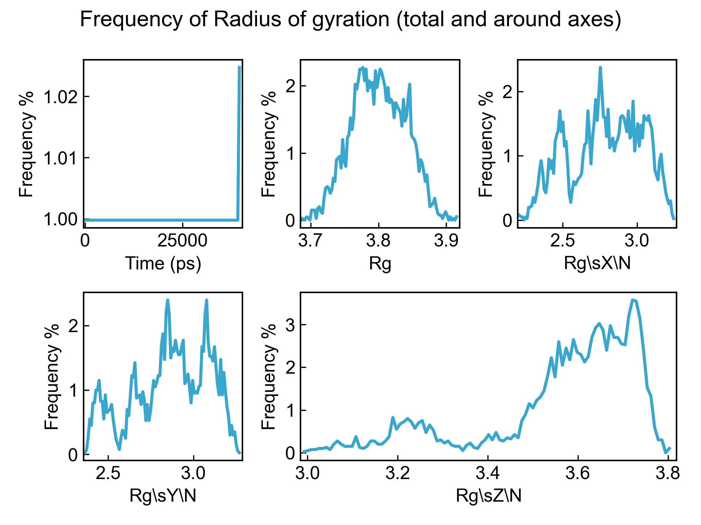
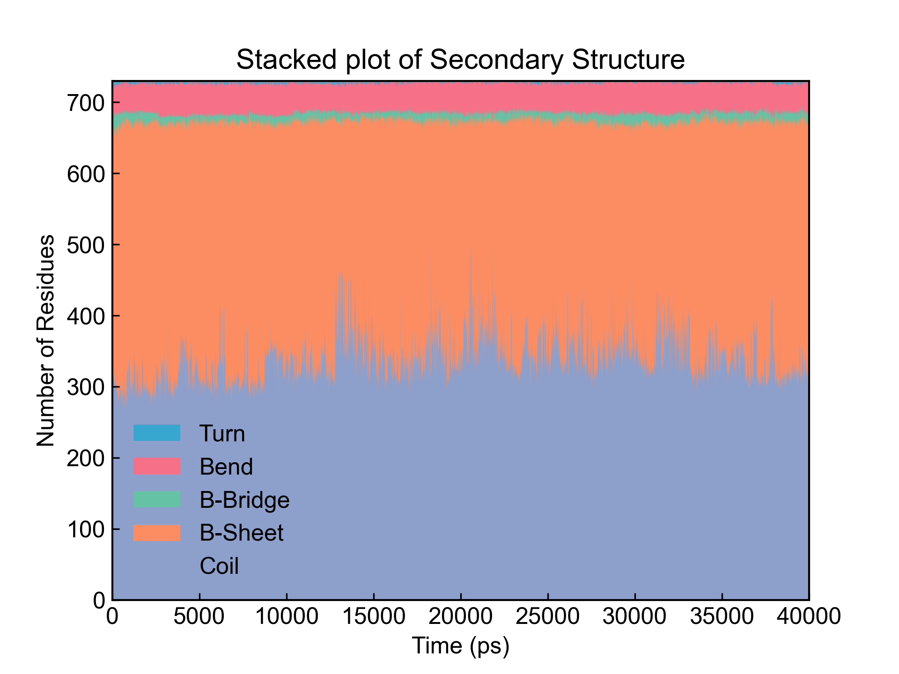
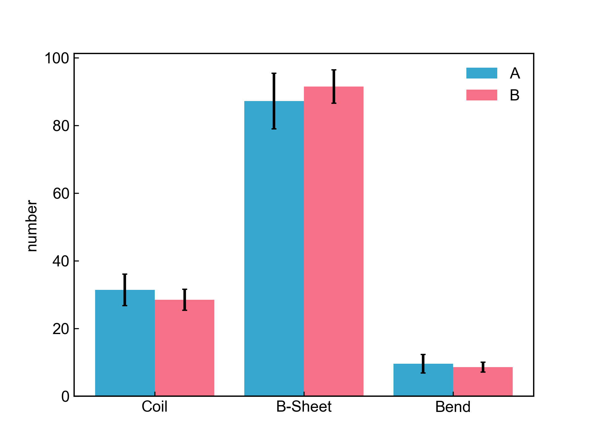
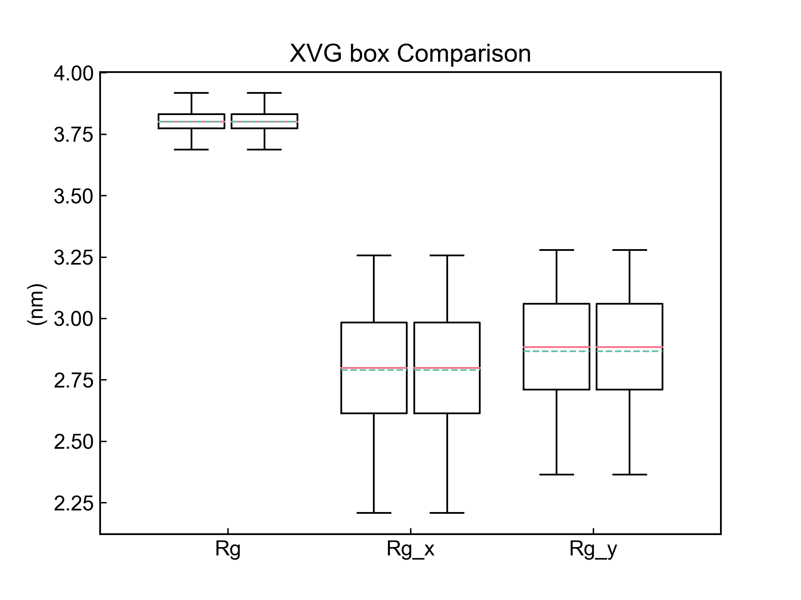
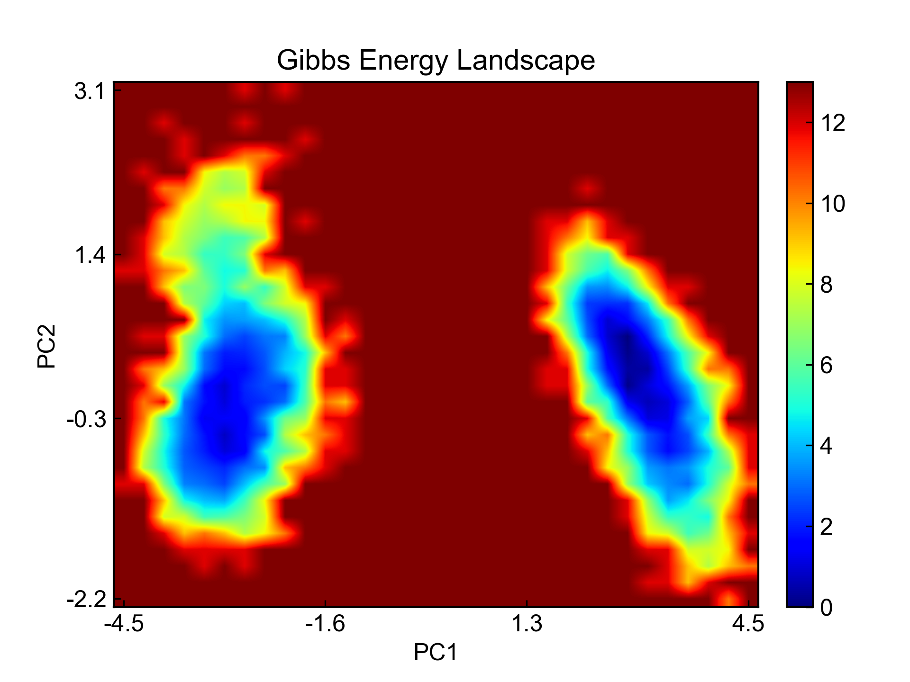
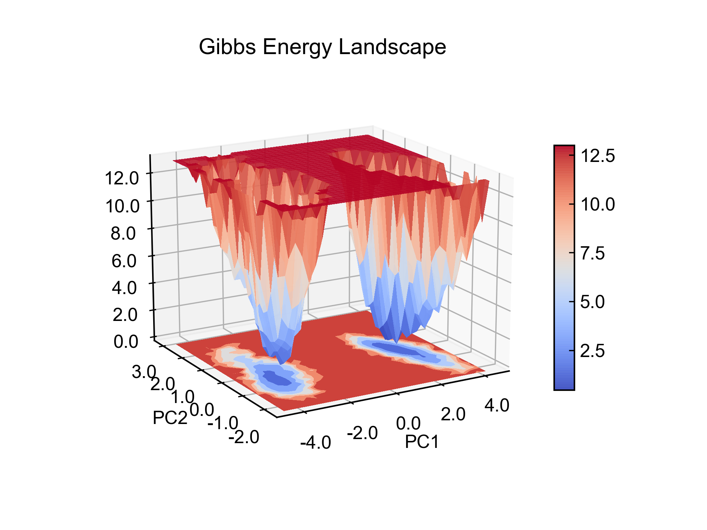

## Installation

DIT可以通过源码安装(https://github.com/CharlesHahn/DuIvyTools)，也可以通过`pip`安装：

```bash
pip install DuIvyTools
```

目前DIT还没发布稳定版本，尝新的话比较建议经常更新一下。


## HELP

跟GROMACS类似，DIT专门有个`help`命令可以输出各个命令的详细信息。以`xvg_show`举例，可以通过如下命令获取帮助信息：

```bash
dit help xvg_show
```

得到的帮助信息如下：

```bash
xvg_show: draw xvg data into line figures.

:examples:
    dit xvg_show -f test.xvg

:parameters:
    -f, --input
            specify the xvg file for input
```

帮助信息主要分为三部分：第一部分简单介绍命令的功能，第二部分有一两句示例，第三部分则是命令的参数和参数的解释。

当然，为了照顾使用习惯，也可以使用如下方式获得同样的命令帮助信息：

```bash
dit xvg_show -h
dit xvg_show --help
dit xvg_show help
```

除此之外，单独输入`dit help`会输出DIT支持的所有命令名，方便查找和使用：

```bash
$ dit help
 *******           **                  **********               **
/**////**         /**          **   **/////**///               /**
/**    /** **   **/** **    **//** **     /**  ******   ****** /**  ******
/**    /**/**  /**/**/**   /** //***      /** **////** **////**/** **////
/**    /**/**  /**/**//** /**   /**       /**/**   /**/**   /**/**//*****
/**    ** /**  /**/** //****    **        /**/**   /**/**   /**/** /////**
/*******  //******/**  //**    **         /**//****** //****** *** ******
///////    ////// //    //    //          //  //////   ////// /// //////

DuIvyTools is a simple analysis and visualization tool for GROMACS result files written by CharlesHahn (https://github.com/CharlesHahn/DuIvyTools).

DuIvyTools provides about 30 commands for visualization and processing of GMX
result files like .xvg or .xpm.

All commands are shown below, type `dit help xvg_show` or `dit xvg_show -h` to show help messages:
    XVG:
        xvg_show, xvg_compare, xvg_ave, xvg_mvave, xvg2csv, xvg_rama
        xvg_show_distribution, xvg_show_stack, xvg_show_scatter
        xvg_energy_compute, xvg_combine, xvg_ave_bar, xvg_box
    XPM:
        xpm_show, xpm2csv, xpm2gpl
    NDX:
        ndx_show, ndx_rm_dup, ndx_rm, ndx_preserve
        ndx_add, ndx_combine, ndx_rename
    MDP:
        mdp_gen
    Others:
        find_center, pipi_dist_ang, hbond, mol_map, dccm_ascii
    Matplotlib Style:
        show_style

You can type `dit help <command>` or `dit <command> -h` for more help messages
about each command, like: `dit help xvg_show` or `dit xvg_show -h`.

And you can also modify the style of figures by adding (only) one mplstyle file to your working directory. DIT will apply it to custom figures. You could
modify mplstyle file based on the template generated by "dit show_style", or
select one from style folder of DuIvyTools github repo
(https://github.com/CharlesHahn/DuIvyTools).

Have a good day !
```


## XVG

XVG模块目前包含了13个命令，命令以xvg开头，都是用于处理xvg格式的文件的。


### xvg_show

读文件绘图，默认第0列是X值，第1列及之后的是数据。如果有多列数据，就绘制成子图的样式。

**注意，DIT中列和行的计数都是从0开始的！**

```bash
dit xvg_show -f rmsd.xvg
```




### xvg_compare

比起`xvg_show`，我很推荐使用`xvg_compare`。即使不需要数据的比较，这个命令的灵活性也更大些。

`xvg_compare`，提供一个或几个文件，提供一组列索引，即可把索引到的列的数据都绘制出来。

```bash
dit xvg_compare -f rmsd.xvg gyrate.xvg -c 1 1,2
```



这里的索引可能有些奇怪，为啥是`1 1,2`。这里实际上是两个索引（一个索引是1，还有一个是索引组1,2）。前面赋给了两个文件，所以这里索引（索引组）的数量得和前面的文件的数量对应，也即是两个索引。索引（索引组）之间用空格隔开。同一个索引组里的索引，如1,2，用逗号隔开。第一个索引1对应第一个输入文件的第一列数据，在这里也就是RMSD；第二个索引1,2对应第二个输入文件，也即Gyrate数据的Rg和RgX这两列数据。

这样的索引的赋值方法，可以使得在每一个输入文件里选择不同的列进行比较。

需要注意的是，输入文件的第0列不一定要完全相同。这里的折线图的绘制，默认就是以对应文件的第0列为X值的。RMSD的第1列数据是以rmsd.xvg的第0列数据作为X值，Gyrate的第1,2列数据是以gyrate.xvg的第0列作为X值的。

`xvg_compare`这个命令还有其它的参数。虽然legend、xlabel、ylabel等都可以自动解析和赋值，大多数情况下也还能看，但是也可以通过参数手动赋值。

`-l`参数可以用于图例的赋值，参数的数量和选择的列的数量要保持一致，且不需要对应文件了。目前还不支持在图例里有空格，空格在这里是区分不同图例的标志。我会在下一个小版本里改进，用一个标识符表示空格。

```bash
dit xvg_compare -f rmsd.xvg gyrate.xvg -c 1 1,2 -l RMSD gyrate gyrate_X -x Time(ns) -y (nm) -t hhh
```

还可以通过`-s`、`-e`，也就是start和end来设定每一列数据的使用范围，也即起止行数，比如说`-s 10 -e 100`就是指只使用每一列数据的第11个到第100个（包含）数据。

这个方法里面还包括了求滑动平均的选项，声明一下`-smv`就可以了。求滑动平均有两个参数需要解释下：窗口宽度(windowsize)和置信度(confidence)，默认是50和0.9，当然也可以自己赋值确定。

```bash
dit xvg_compare -f energy.xvg -c 1,3 -l LJ(SR) Coulomb(SR) -smv
```



滑动平均的计算有点儿慢现在，后续再优化吧。


### xvg_ave

`xvg_ave`就是用来求每一列数据的平均的，当然你也可以声明起止行数。用来求平衡时期的某些数据的平均值还是挺好用的。

```bash
$ dit xvg_ave -f rmsd.xvg -s 2000 -e 4000
Info -> read rmsd.xvg successfully.

                       Time (ps)       RMSD (nm)
             ave      29995.0000          0.4281
             std       5773.5020          0.0473
```

需要注意的是，`-s`声明的起始行是被包括在计算数据中的，而`-e`声明的行则不被包括。如果你要计算到列的末尾，那就只声明`-s`就行了。比如说这里的rmsd.xvg一共就4000行，声明了`-e 4000`之后，实际上只从2000行计算到了3999行，最后一行没有被包括。再次说明，DIT中列和行的计数，都是从0开始的。


### xvg_mvave

给定一个xvg文件，求出每一列数据的滑动平均数据，并输出到csv文件。


### xvg2csv

把xvg数据文件转化成csv文件，声明输入输出文件就可以了。不再赘述。


### xvg_rama

gmx的`rama`命令是可以得到蛋白质的二面角(phi和psi)数据的，`xvg_rama`命令就是把这样的数据转换成拉式图。这个命令的大部分内容借鉴自PyRAMA项目。

```
dit xvg_rama -f rama.xvg
```




### xvg_show_distribution

`xvg_show`展示数据的变化，`xvg_show_distribution`展示数据的分布，如果有多列数据的话，也是会绘制成组图。

```bash
dit xvg_show_distribution -f gyrate.xvg
```



可以通过`-bin`参数定义要求的分布的格子数，默认是100。最大的数据会归到最大的bin里面，这也就导致了第一个图时间的分布最后有个小的抬头。


### xvg_show_stack

`xvg_show_stack`命令主要是绘制**堆积折线图**的。有时候需要绘制蛋白质二级结构含量的变化，就可以用这种堆积折线图对`do_dssp`命令得到的二级结构含量xvg文件进行绘图。

```bash
dit xvg_show_stack -f dssp_sc.xvg -c 2 3 4 5 6 
```



用`-c`参数指定要堆积的列，程序会自动将选中的列绘制为堆积折线图。


### xvg_show_scatter

不消说，`xvg_show_scatter`是绘制散点图的，通过`-xi`、`-yi`指定两列，分别为X值和Y值，然后绘制成散点图。

```bash
dit xvg_show_scatter -f rama.xvg -xi 0 -yi 1
```


### xvg_energy_compute

分子间相互作用，如果你用基于相互作用原理的方法计算的话（相互作用能 = 复合物能量 - 分子A能量 - 分子B能量），这个命令可以帮你快速执行这一过程。

输入三个文件，复合物能量文件、分子A能量文件、分子B能量文件；每个文件应包含且只包含五列数据（时间、LJ(SR)、Disper.corr.、Coulomb(SR)、Coul.recip.），顺序也要正确。这个脚本会读入这三个文件，然后执行计算，输出计算结果到xvg文件。

```bash
dit xvg_energy_compute -f prolig.xvg pro.xvg lig.xvg -o results.xvg
```

当然现在我不太建议你用这个方法了。比较推荐你设置能量组，增大cutoff直接rerun，得到的数据似乎还更准确一些。


### xvg_combine

`xvg_combine`和`xvg_compare`的命令输入方式类似，功能也类似。`xvg_compare`将你选中的数据绘制出来，`xvg_combine`则是将你选中的数据重新输出到一个新的xvg文件中。

```bash
dit xvg_combine -f f1.xvg f2.xvg -c 1,2 2,3 -o res.xvg
```


### xvg_ave_bar

`xvg_ave_bar`就可复杂了，光是说起来就得费一番口舌。

我们假设这样一个场景：你模拟了三个不同的配体分别与蛋白的相互作用，每一个体系都进行了三次平行模拟，这样你就一共有9个模拟轨迹，相应的有9个蛋白与配体的氢键数量随时间变化的xvg文件。现在咱们需要把每一个模拟体系的稳定时期的平均氢键数量计算出来，然后做体系之间的比较。

按照通常的做法，我们需要先对每一个xvg文件中稳定时期的氢键数目求个平均值，一共有9个平均值。然后把同样体系的三次平行的平均值再求个平均，以及误差。最后把三个体系的平均值和误差作成柱状图。

没错，`xvg_ave_bar`大概就是干这个活儿的。

先看示例，再具体解释各个参数的含义。

```bash
dit xvg_ave_bar -f f1_1.xvg,f1_2.xvg,f1_3.xvg f2_1.xvg,f2_2.xvg,f2_3.xvg -c 2 3 5 -l A B -y number
```



上图绘制的是两个体系（各有三次平行模拟）的蛋白的二级结构含量图。

首先需要解释的是`-f`参数，这个参数读入若干个文件组，文件组和文件组之间用空格隔开；一个文件组就表示一个体系。每一个文件组内部可以有多个文件，文件名和文件名之间用逗号隔开，这表示一个模拟体系的多次平行模拟。程序会自动对同一个文件组内的多个平行模拟的数据文件求平均和误差，然后绘图进行不同文件组之间的比较。上图有两个体系，A和B，每个体系内有3个平行模拟的数据文件。

`-c`参数呢就是选择要对比的数据列了，这个参数的值会应用到每一个文件中。比如这里，就是选择了每一个文件的2、3、5列进行绘图，因而最终的图上会有三个X值。

`-l`参数是用于手动指定图例的，图例的数量要和文件组的数量一致！

`-xt`参数用于指定在X轴上显示的内容，数量与选择的列数一致。

还可以指定xlabel、ylabel、title、要包括的数据的起止等等。

值得一提的是，有一个`-ac`参数，指定了这个参数，搭配`-o`参数指定输出文件名，可以把计算得到的平均值和误差等数据输出到文件中，默认是输出到屏幕上的。


### xvg_box

`xvg_box`会对数据绘制箱型图，比较数据分布情况。

```bash
dit xvg_box -f f1.xvg f2.xvg -c 1 2 3 -xt Rg Rg_x Rg_y
```



`-f`参数指定几个文件，然后`-c`选定几个列（选定的列索引会应用到所有指定的文件中），就可以绘制出箱型图。

需要注意的是，这里需要保证每个xvg数据文件里面的相应的列表达的是同一个意思，比如这里的文件的第1列都是Rg，之后两个列都是Rg_x和Rg_y。程序不会检查有没有对应上。

`-xt`参数用于声明X轴上显示的值，数量与-c一致。还可以指定xlabel等等。

我想这个功能估摸着是用不到的，写得草率。


## XPM

XPM模块包含3个命令，都是处理XPM文件的；命令以xpm打头。


### xpm_show

`xpm_show`用于可视化xpm文件，`-ip`指定要不要插值，`-pcm`指定要不要使用pcolormesh函数绘图，`-3d`指定要不要绘制3d图，`-o`参数可以用于保存图片文件，`-ns`参数可以指定不显示图片。

```bash
dit xpm_show -f test.xpm -ip
```



```bash
dit xpm_show -f test.xpm -3d
```



基本上所有GMX生成的XPM图都可以用`xpm_show`可视化，包括dssp的图和hbmap的图。


### xpm2csv

`xpm2csv`可以将xpm文件转化为csv文件，也即三列数据(x, y, v)，横纵坐标以及对应的像素点的值。

```bash
dit xpm2csv -f test.xpm -o test.csv
```


### xpm2gpl

Gnuplot是一个很好的绘图软件，它可以通过脚本进行绘图。`xpm2gpl`命令则是把xpm文件转化为gnuplot的绘图脚本gpl文件（不一定后缀得是gpl，只是这里为了方便定义为了gpl）。用Gnuplot绘制出来的蛋白质二级结构变化图是很好看的。

```bash
dit xpm2gpl -f test.xpm -o test.gpl
```


## NDX

NDX模块共7个命令，以ndx开头，用于处理ndx文件。

**我比较推荐你使用gmx的`make_ndx`命令处理ndx文件，功能更丰富，也更好用**。

### ndx_show

`ndx_show`命令会输出ndx文件中所有的索引组的名字。

```bash
dit ndx_show -f test.ndx
```


### ndx_rm_dup

`ndx_rm_dup`命令会删除ndx文件中所有重复的索引组。这里的重复的索引组是指不仅名字一样，索引也一样的组。

```bash
dit ndx_rm_dup -f test.ndx -o res.ndx
```


### ndx_rm

`ndx_rm`用于移除索引文件中的某些索引组，你可以通过`-gl`参数指定几个索引组的名字，`ndx_rm`会把这些指定的索引组移除，保留其它的索引组。还可以通过`-int`参数激活互动模式，可以在互动模式里决定是否删除某一个索引组。

```bash
dit ndx_rm -f test.ndx -o res.ndx -gl Protein Ligand
dit ndx_rm -f test.ndx -o res.ndx -int
```


### ndx_preserve

`ndx_preserve`和`ndx_rm`基本类似，只是被选中的索引组不再被删除，而是被保留；未被选中的索引组才会被删除。同样也有互动模式。


### ndx_add

`ndx_add`可以给索引文件增加一个索引组，需要你通过`-gn`执行索引组的名字，`-s`、`-e`、`-t`三个参数指定索引数字的起始、结束和步长。如果你熟悉python的range函数的话，应该很好理解这三个参数的作用。

```bash
dit ndx_add -f test.ndx -o res.ndx -gn hhh -s 10 -e 100 -t 2
```

上述的命令添加一个叫hhh的索引组，数字是从10开始一直到100（不包括）的偶数。`-t`也可以缺省，默认步长是1。

有的时候（比如做dPCA）需要自己手写一个索引组，因而`ndx_add`或许还有点儿用途。


### ndx_combine

`ndx_combine`可以组合几个索引组到一个新的索引组，需要指定`-gn`和`-gl`两个参数。


### ndx_rename

`ndx_rename`主要是给索引组改名字的，可以`-int`互动模式更改，也可以指定旧名字`-on`和新名字`-nn`来更改名字。


## MDP

MDP模块就一个命令了。

### mdp_gen

`mdp_gen`命令可以帮助你在当前工作目录生成一个模板mdp文件。有个`-a`参数，用于指定mdp文件的用途，根据用途不同，会生成不同的文件内容。目前`-a`可以接受如下几个参数中的一个：ions、em、nvt、npt、md、blank。比如说：

```bash
dit mdp_gen -o npt.mdp -a npt
```

上述命令会在当前目录生成一个可用于npt的mdp模板文件。

**需要说明的是，这里生成的mdp模板文件不一定适合你的体系，请生成之后一定打开自行设置和调整相关的参数**。这个命令只是帮你免去把mdp文件复制来复制去的工夫。

这里的这几个mdp模板文件实际上都存储在DuIvyTools这个第三方包目录的data文件夹下，你也可以根据你的需要直接修改这里的文件。

这部分功能后续也将继续优化，我希望能集合大家用于不同模拟方向的mdp文件，凑在一起，方便大家使用。


## Other Modules

### show_style

```bash
dit show_style
```

`show_style`命令是v0.4.7新加入到DIT，执行这个命令会在当前工作目录生成一份DIT默认的matplotlib style sheet，也即绘图的样式控制文件。用户可以根据自己需要更改。

matplotlib style相关的参数可以参考 https://matplotlib.org/stable/tutorials/introductory/customizing.html#the-matplotlibrc-file

当然，用户也可以自己找一个样式控制文件（.mplstyle）置于当前工作目录，DIT会优先读取并绘图。


### find_center

```bash
find_center: to find the atom which is nearest to center of atom group.

:examples:
    dit find_center -f test.gro
    dit find_center -f test.gro -n index.ndx
    dit find_center -f test.gro -n index.ndx -aa

:parameters:
    -f, --input
            the gro file which contains one frame of molecule coordinates
    -n, --index
            the index file which you could select group from
    -aa, --AllAtoms
            if to find center of one group atoms in all atoms
```

`find_center`命令主要用于寻找gro文件中组分的几何中心。
用户可以通过指定索引文件和索引组以寻找特定组的几何中心。如果参数中不包括索引文件，则默认寻找整个gro文件所有原子的几何中心。
`-aa`参数的意思是是否在全体原子中寻找指定原子组的几何中心。有的时候，距离指定原子组的几何中心的原子不一定出现在该组中，所以加了这么个参数。


### pipi_dist_ang

```bash
pipi_dist_ang: to calculate the distance and angles between two rings or between one ring and one vector defined by atom group or command line.

:examples:
    dit pipi_dist_ang -f test.gro -n test.ndx
    dit pipi_dist_ang -f test.gro -n test.ndx -select ring1 ring2
    dit pipi_dist_ang -f test.gro -n test.ndx -select ring1 -vg
    dit pipi_dist_ang -f test.gro -n test.ndx -select ring1 -vec 6 6 6

:parameters:
    -f, --input
            the gro file which contains frames of molecule coordinates
    -n, --index
            the index file which contains atom index groups of rings or vector groups
    -b
            the frame number to start calculation, default=0
    -dt
            the frame interval, default=1
    -o, --output
            the output filename to save results
    -vg
            whether to get vector from index group, default=False
    -vec
            specify the vector by command line, eg. -vec 6 6 6
    -select
            select the groups from command line
```

`pipi_dist_ang`主要是用于计算两个环（5-7元环）的几何中心距离以及环法向的夹角。
用户通过在索引文件中新增原子组，并在其中定义相应的环的原子序号，就可以利用此命令计算环与环的距离和角度了。DIT会读入指定的原子索引，然后计算得到几何中心以及法向向量，之后得到距离和角度。

此命令还支持自定义一个向量，以计算特定环的法向与指定向量的角度变化。用户可以通过`-vec`参数在命令行中指定向量，也可以直接在索引文件中新建一个包含两个原子的组，两个原子的坐标即可形成一个向量。


### hbond

```bash
hbond: A useful method to process hbond related files generated by `gmx hbond`,
        you can get hbond occupancy figure and table infos from `dit hbond`.
        note: the hbond names will show on figure only when number of hbonds
              less than 10.

:examples:
    dit hbond -f md.gro -n hbond.ndx -m hbmap.xpm
    dit hbond -f md.gro -n hbond.ndx -m hbmap.xpm -c 5 7
    dit hbond -f md.gro -n hbond.ndx -m hbmap.xpm -c 5 7 0-3
    dit hbond -f md.gro -n hbond.ndx -m hbmap.xpm -o test.png -csv test.csv -ns
    dit hbond -f md.gro -n hbond.ndx -m hbmap.xpm -hnf d_resname(d_resnum)@d_atomname(d_atomnum)->h_atomname(h_atomnum)...a_resname(a_resnum)@a_atomname(a_atomnum)
    dit hbond -f md.gro -n hbond.ndx -m hbmap.xpm -hnf "d_resname@d_atomname -> h_atomname ... a_resname@a_atomname"
    dit hbond -f md.gro -n hbond.ndx -m hbmap.xpm -hnf "d_atomname@h_atomname -> a_atomname"
    dit hbond -f md.gro -n hbond.ndx -m hbmap.xpm -hnf "number"

:parameters:
    -f, --input
            the gro file which contains one frame of molecule coordinates,
            used to get atom names.
    -n, --index
            the index file generated by `gmx hbond`
    -m, --map
            the hbond map file (hbmap.xpm) generated by `gmx hbond`
    -c, --select
            select the hbond id to only show the selected hbonds
    -o, --output
            the figure name you want to save
    -csv, --csv
            save the table infos into a csv whose name is specified here
    -ns, --noshow
            whether not to show figure, useful on computer without gui
    -hnf, --hbond_name_format
            define the hbond name format by user!
            Each atom has four features: resname, resnum, atomname, atomnum.
            Distinguish donor, hydrogen, acceptor by adding one prefix to each
            feature, like: d_resname, a_resnum, h_atomname. So you may able to
            define hbond name style by:
            'd_resname(d_resnum)@d_atomname(d_atomnum)->h_atomname(h_atomnum)...a_resname(a_resnum)@a_atomname(a_atomnum)'
            which is the default style, or also you could specify
            'd_atomname@h_atomname...a_atomname'
            or some format you would like.
            Or you could just set hnf to be 'number' to show hbond id on figure
```

`hbond`命令主要用于生成氢键占有率图、给出氢键占有率信息。

`gmx hbond`命令执行结束之后会生成氢键的索引文件、氢键数量的xvg文件以及氢键占有率的xpm文件，而`dit hbond`命令需要读入一个体系的gro文件、氢键索引文件、氢键xpm文件。索引文件和gro文件主要用于获取形成氢键的原子的名称等信息，而xpm文件则包含了氢键占有率的信息。此命令会依赖这三个文件， 绘制出氢键占有率图，并在命令行中输出每个氢键的占有率。

用户可以通过`-hnf`参数自定义氢键的名称格式。每个原子包含四种属性：`resname`、`resnum`、`atomname`、`atomnum`，而前缀`d_`、`a_`、`h_`则分别代表了供体、受体、氢原子。用户将这些关键词组合在一起，即可定义自己需要的氢键名称格式。当然，也可以将`-hnf`设定为`number`，这将让DIT直接输出氢键的序号作为氢键的名字。

### mol_map

**此命令不建议使用，算法上仍有一些问题需要解决。**

如果两个分子构象完全相同，但是每个原子的坐标不同，可以通过此命令将两个分子的坐标替换，也即将分子从一个坐标转换到另一个坐标。

### dccm_ascii

<++>


## Cite DuIvyTools


> DuIvyTools目前是基于GPLv3协议开源的。我欢迎大家在日常工作中使用和修改，但**不得以任何理由使用DuIvyTools牟利**，包括但不限于付费获取、商业使用等等。

Cite DuIvyTools by：

[](https://doi.org/10.5281/zenodo.7261532)

