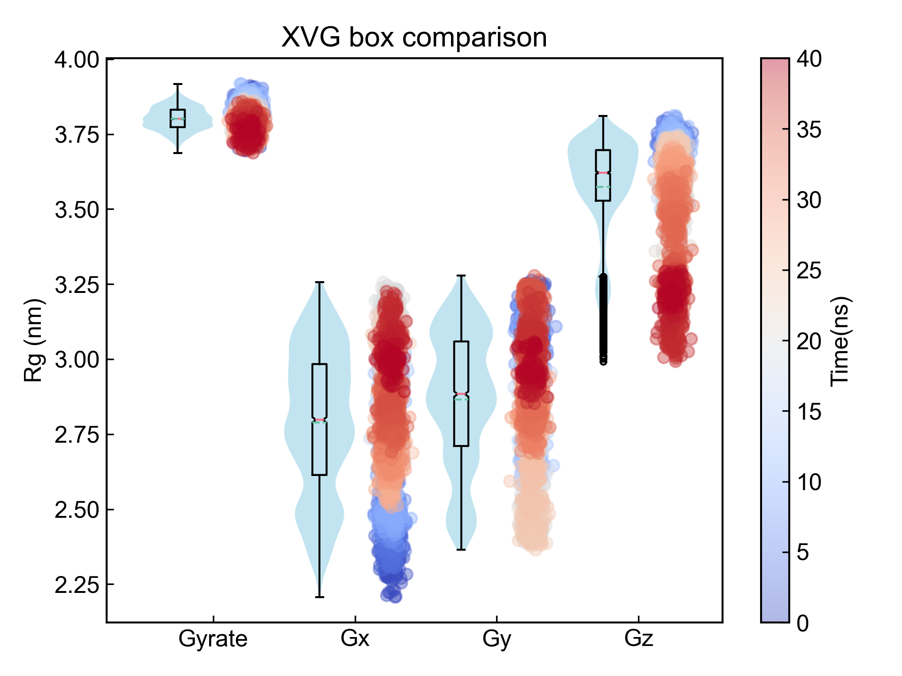

# DuIvyTools v0.5.0


历时两个月的紧张开发，DuIvyTools终于基本重构完成。


从用户层面讲，DIT v0.5.0 新增的特性如下：

1. 新增了plotly、Gnuplot、以及plotext绘图引擎
   1. plotly: 强交互性，用户可以通过plotly的格式控制文件精调图片的每个细节
   2. Gnuplot: 老牌开源绘图软件，需要用户自行安装好Gnuplot并设置好环境变量（可通过`gnuplot`命令调用），出图质量较高且Gnuplot用户可以方便地自定义图片的每个细节
   3. plotext: 命令行绘图，只支持最简单的数据可视化（折线图和尺寸较小的image）
   4. 原有的matplotlib: 优化了一些绘图的细节，增加了对图像上元素的控制，colorbar、legend，colormap等都支持用户通过命令行或matplotlib的格式控制文件进行调整
2. 所有命令统一使用一套命令参数，降低使用成本
3. 更强更稳健的文件解析器


从开发角度讲，DIT v0.5.0和之前的DIT v0.4.8基本上没有什么相同点了。为了程序的简洁可靠，一些v0.4.8中的复杂逻辑的命令被删除了（`hbond`，`pipi_dist_ang`, `dssp`），但同时为了对用户保留原有的功能，现在的打包中也包含了修复了部分bug的v0.4.8以对v0.5.0中删除的功能进行补充。这两个版本在安装之后，可以分别使用`dit` (v0.5.0) 和 `dito` (v0.4.8) 调用，互不干扰。在后续的版本中，`dito` v0.4.8将被删除。


在DIT使用过程中，如果您遇到任何程序问题或者疑问，都请在DuIvy飞书群中新建话题并提问和讨论，很抱歉因为工作繁忙我可能不会及时回复，但是我每天会抽时间查看并尝试解决问题。


## Installation

DIT可以通过源码安装(https://github.com/CharlesHahn/DuIvyTools)，也可以通过`pip`安装：

```bash
pip install DuIvyTools
```


## 命令行

`dit`是一个基于命令行的软件。用户在命令行里输入命令，对数据进行操作和绘图。


### 帮助信息

用户可以通过`dit`命令获取所有可用的命令的名字及简短的信息：

```bash
 *******           **                  **********               **
/**////**         /**          **   **/////**///               /**
/**    /** **   **/** **    **//** **     /**  ******   ****** /**  ******
/**    /**/**  /**/**/**   /** //***      /** **////** **////**/** **////
/**    /**/**  /**/**//** /**   /**       /**/**   /**/**   /**/**//*****
/**    ** /**  /**/** //****    **        /**/**   /**/**   /**/** /////**
/*******  //******/**  //**    **         /**//****** //****** *** ******
///////    ////// //    //    //          //  //////   ////// /// //////

DuIvyTools is a simple analysis and visualization tool for GROMACS result files written by 杜艾维 (https://github.com/CharlesHahn/DuIvyTools).

DuIvyTools provides about 30 commands for visualization and processing of GMX result files like .xvg or .xpm.

All commands are shown below:
XVG:
    xvg_show              : easily show xvg file
    xvg_compare           : visualize xvg data
    xvg_ave               : calculate the averages of xvg data
    xvg_energy_compute    : calculate eneries between protein and ligand
    xvg_combine           : combine data of xvg files
    xvg_show_distribution : show distribution of xvg data
    xvg_show_scatter      : show xvg data by scatter plot
    xvg_show_stack        : show xvg data by stack area plot
    xvg_box_compare       : compare xvg data by violin and scatter plots
    xvg_ave_bar           : calculate and show the averages of parallelism
    xvg_rama              : draw ramachandran plot from xvg data
XPM:
    xpm_show              : visualize xpm data
    xpm2csv               : convert xpm data into csv file in form (x, y, z)
    xpm2dat               : convert xpm data into dat file in form (N*N)
    xpm_diff              : calculate the difference of xpms
    xpm_merge             : merge two xpm by half and half
Others:
    mdp_gen               : generate mdp file templates
    show_style            : show figure control style files
    find_center           : find geometric center of one group of atoms
    dccm_ascii            : convert dccm from ascii data file to xpm
    dssp                  : generate xpm and xvg from ascii file of gmx2023
    ndx_add               : new a index group to ndx file
    ndx_split             : split one index group into several groups
    ndx_show              : show the groupnames of index file

You can type `dit <command> -h` for detailed help messages about each command, like: `dit xvg_show -h`.

All possible parameters could be inspected by `dit -h` or `dit --help`.

Cite DuIvyTools by DOI at https://doi.org/10.5281/zenodo.6339993

Have a good day !
```

还可以通过`dit -h`可以获取DIT中的所有参数，以及通过`dit <command> -h`可以获得具体命令的相关信息和输入参数。


### 参数介绍

以下是DIT中的全部参数：

```bash
DuIvyTools: A Simple MD Analysis Tool

positional arguments:
  cmd                   command of DIT to run

optional arguments:
  -h, --help            show this help message and exit
  -f INPUT [INPUT ...], --input INPUT [INPUT ...]
                        specify the input file or files
  -o OUTPUT, --output OUTPUT
                        specify the output file
  -ns, --noshow         not to show figure
  -c COLUMNS [COLUMNS ...], --columns COLUMNS [COLUMNS ...]
                        select the column indexs for visualization or calculation, or input numerical list
  -l LEGENDS [LEGENDS ...], --legends LEGENDS [LEGENDS ...]
                        specify the legends of figure or data
  -b BEGIN, --begin BEGIN
                        specify the index for beginning (include)
  -e END, --end END     specify the index for ending (not include)
  -dt DT, --dt DT       specify the index step, default to 1
  -x XLABEL, --xlabel XLABEL
                        specify the xlabel of figure or data
  -y YLABEL, --ylabel YLABEL
                        specify the ylabel of figure or data
  -z ZLABEL, --zlabel ZLABEL
                        specify the zlabel of figure or data
  -t TITLE, --title TITLE
                        specify the title of figure or data
  -xmin XMIN, --xmin XMIN
                        specify the X value limitation, x_min
  -xmax XMAX, --xmax XMAX
                        specify the X value limitation, x_max
  -ymin YMIN, --ymin YMIN
                        specify the Y value limitation, y_min
  -ymax YMAX, --ymax YMAX
                        specify the Y value limitation, y_max
  -zmin ZMIN, --zmin ZMIN
                        specify the Z value limitation, z_min
  -zmax ZMAX, --zmax ZMAX
                        specify the Z value limitation, z_max
  --x_precision X_PRECISION
                        specify the precision of X values for visualization
  --y_precision Y_PRECISION
                        specify the precision of Y values for visualization
  --z_precision Z_PRECISION
                        specify the precision of Z values for visualization
  -xs XSHRINK, --xshrink XSHRINK
                        modify X values by multipling xshrink, default to 1.0
  -ys YSHRINK, --yshrink YSHRINK
                        modify Y values by multipling yshrink, default to 1.0
  -zs ZSHRINK, --zshrink ZSHRINK
                        modify Z values by multipling zshrink, default to 1.0
  -smv, --showMV        whether to show moving averages of data
  -ws WINDOWSIZE, --windowsize WINDOWSIZE
                        window size for moving average calculation, default to 50
  -cf CONFIDENCE, --confidence CONFIDENCE
                        confidence for confidence interval calculation, default to 0.95
  --alpha ALPHA         the alpha of figure items
  -csv CSV, --csv CSV   store data into csv file
  -eg {matplotlib,plotext,plotly,gnuplot}, --engine {matplotlib,plotext,plotly,gnuplot}
                        specify the engine for plotting: 'matplotlib', 'plotext', 'plotly', 'gnuplot'
  -cmap COLORMAP, --colormap COLORMAP
                        specify the colormap applied for figures, available for 'matplotlib' and 'plotly' engine
  --colorbar_location {None,left,top,bottom,right}
                        the location of colorbar, also determining the orientation of colorbar, ['left', 'top', 'bottom', 'right'], available for 'matplotlib'
  --legend_location {inside,outside}
                        the location of legend box, ['inside', 'outside'], available for 'matplotlib' and 'gnuplot'
  -m {withoutScatter,pcolormesh,3d,contour,AllAtoms,pdf,cdf}, --mode {withoutScatter,pcolormesh,3d,contour,AllAtoms,pdf,cdf}
                        additional parameter: 'withoutScatter' will NOT show scatter plot for 'xvg_box_compare'; 'imshow', 'pcolormesh', '3d', 'contour' were used for 'xpm_show' command; 'AllAtoms' were used
                        for 'find_center' command; 'cdf' and 'pdf' are for 'xvg_show_distribution' command;
  -al ADDITIONAL_LIST [ADDITIONAL_LIST ...], --additional_list ADDITIONAL_LIST [ADDITIONAL_LIST ...]
                        additional parameters. Used to set xtitles for 'xvg_ave_bar'
  -ip INTERPOLATION, --interpolation INTERPOLATION
                        specify the interpolation method, default to None
  -ipf INTERPOLATION_FOLD, --interpolation_fold INTERPOLATION_FOLD
                        specify the interpolation fold, default to 10
```

下面依次介绍各个参数：

`-f`参数主要用于输入文件，具体输入文件的类型在不同的命令中有所不同，主要以xvg文件和xpm文件为主。可以同时输入多组文件，每组文件之间用空格隔开，组内文件用逗号隔开。

`-o`参数用于指定输出文件的名字；在对数据进行可视化的时候，此参数一般用于指定输出图片的名字；如果是数据处理的命令，则此参数一般用于指定输出文件的名字。

`-ns` 如果需要不显示图片，则加上该参数。对于Gnuplot绘图引擎，加上该参数DIT会直接输出Gnuplot的输入脚本。

`-c`  选择数据列，这个参数通常在xvg文件相关的操作中用得多。比如说`-c 1-7,10  0,1,4` 表示选择第一组xvg文件的第1到6列数据，第10组数据，以及选择第二组文件的第0列，1列和第4列数据。**注意，该参数的计数都是从0开始的。** 同时，短横`-`两端的列序号，是左边包含右边不包含的，所以上面的`1-7`是第1到第6列，不包括第7列。在某些情况下，该参数也用于数据的生成，比如说`dssp`命令中将之用于用户指定残基的序号。

`-l` 指定绘图的legends，不同的命令中关于指定legends的数量有不同的要求。如果你想不显示legend，可以将之设置为“”，例如`-l "" "" ""`即可不显示legend。同时也支持简单的latex语法，如`-l "$nm^2$" "$\Delta G_{energy}$"`。

`-b`, `-e`, `-dt`  这三个参数用于指定数据的哪些行用于数据处理和绘图。如`-b 100 -e 201 -dt 2`这句的意思是只对第100行到第200行（包括）的偶数行数据进行处理。同样的，这里的行索引也是从0开始计数的。在`dssp`命令中，这三个参数也用于时间序列的生成。

`-x`, `-y`, `-z` 这三个参数用于指定数据的X，Y，和Z的label。常见的图只包含两个数据维度，对于有颜色标签的散点图、3D图、热力图等则可能需要指定第三个维度的标签，也即`-z`。如果你想不显示，可以将之设置为“”。同时也支持latex语法，如`-Z "$\Delta G_{energy}$"`。

`-t`  指定图片的title。如果你想不显示，可以将之设置为“”。同时也支持latex语法。

`-xmin`, `-xmax`, `-ymin`, `-ymax`, `-zmin`, `-zmax` 这一组参数通常用于指定数据的截断。`-xmin`, `-xmax`, `-ymin`, `-ymax`常用于指定xvg数据生成图片的X和Y轴的上下界数值；对于xpm数据则是用于指定对xpm图片的切割。是的，DIT支持只可视化xpm图片的一部分。 `-zmin`, `-zmax` 则通常用于指定第三个数据维度（通常是colorbar）的数据上下界。

`--x_precision`, `--y_precision`, `--z_precision`  用于设置三个数据维度的数据呈现精度，如`--x_precision 2` 则是X轴数据标签都显示2位小数点后的数字。`--z_precision`通常用于指定colorbar等第三个数据维度的数据呈现精度。

`-xs`, `-ys`, `-zs` 对三个维度的数据进行缩放，如`-xs 0.001` ，则所有第一个数据维度的数据都会被乘以0.001。

`-smv`, `-ws`, `-cf` 这一组参数用于绘制xvg数据的滑动平均，分别是指定是否绘制滑动平均值，设置滑动平均的窗口大小，设置置信区间的可信度。

`--alpha` 通常用于指定绘图的透明度。

`-csv` 对于已经有绘图的命令，此参数可用于将一些数据导出成csv文件；如`xvg_compare`命令搭配这个参数可以将xvg数据转换成csv数据。

`-eg` 用于指定绘图引擎，目前DIT支持四种绘图引擎，matplotlib、plotly、gnuplot（需要自行安装并添加环境变量，保证在命令行中`gnuplot`可以调用），以及plotext（用于直接在命令行中绘制简单的图形）。默认的绘图引擎是matplotlib。

`-cmap` 用于指定绘图的colormap，对于matplotlib和plotly有效。如果开始不清楚具体的可选参数，可以随便写，报错信息里面会列出所有可能的colormap参数。

`--colorbar_location` 用于指定colorbar的位置，目前只对matplotlib有效。

`--legend_location`  用于指定图例的位置，目前对matplotlib和gnuplot有效。

`-m` 选择模式，对于不同的命令，该参数有不同的值可以选择。

`-al` 一个附加的参数，具体的输入要视命令而定。

`-ip` 是否对xpm文件进行插值，可以选择不同的插值方法。

`-ipf` 如果执行了插值，指定插值的倍数，默认是10。


### 命令详情

每一个命令的详细信息、可用参数、使用示例都可以通过`dit <command> -h`获得，比如：

```bash
$ dit xpm_show -h
====== command: xpm_show ======

    Visualize the xpm file.
    DIT support 4 plot engines (matplotlib, plotly, gnuplot, and plotext) and several modes to plot xpm into figures. 4 modes for matplotlib (imshow which is default, pcolormesh, 3d, and contour), and 3 modes for plotly and gnuplot (pcolormesh which is default, 3d, and contour). Plotext only support plotting simple and small size xpm in gray.
    Modes imshow and pcolormesh mainly show the matrix of xpm. For `Continuous` type xpms, matplotlib, plotly and gnuplot will NOT use its original colors, and the colormaps of each engine will be used. For matploblib and plotly, you can set colormaps by `-cmap`. For `Discrete` type of xpms, only pcolormesh of matploblib will NOT use its original colors. But you can set colors by mplstyle file or other style files.For the methods using its original colors, you can set colors by directly modifing the xpm file.
    Mode 3d mainly plot a 3d figure for `Continuous` xpm. Mode contour plot a contour figure for `Continuous` xpm. Also, you can set colormaps by `-cmap`.
    You can perform INTERPOLATION to data by specifing `-ip`.
    For imshow of matplotlib, the interpolation method was using the interpolation method of imshow function of matplobli, and there are lots of interpolation methods could be selected. If you do not know the names of interpolation methods, simply specify `-ip hhh`, then the error message will show you all names of interpolation methods for you to choose.
    For any other engines or modes, DIT use `scipy.interpolate.interp2d` to do the interpolation, so the methods for you to choose is `linear`, `cubic`, and `quintic`. Also, `-ip hhh` trick works. For this interpolation methods, you need to define a `--interpolation_fold` (default to 10).
    DIT support performing xpm cutting by `-xmin`, `-xmax`, `-ymin`, and `-ymax`, like only show 100*100 pixels from a 132*10000 DSSP xpm by setting `-xmin 100 -xmax 200 -ymin 200 -ymax 300`.

    :Parameters:
        -f, --input
                specify the input xpm file (or files)
        -o, --output (optional)
                specify the file name for saving figures
        -ns, --noshow (optional)
                whether not to show figures. When applied to gnuplot, DIT will generate a gnuplot input script
        -x, --xlabel (optional)
                specify the xlabel of figure
        -y, --ylabel (optional)
                specify the ylabel of figure
        -z, --zlabel (optional)
                specify the zlabel of figure
        -t, --title (optional)
                specify the title of figure
        -xs, --xshrink (optional)
                specify the shrink fold number of X values
        -ys, --yshrink (optional)
                specify the shrink fold number of Y values
        -zs, --zshrink (optional)
                specify the shrink fold number of Z values
        -xmin, --xmin (optional)
                specify the xmin index of xpm matrix to show
        -xmax, --xmax (optional)
                specify the xmax index of xpm matrix to show
        -ymin, --ymin (optional)
                specify the ymin index of xpm matrix to show
        -ymax, --ymax (optional)
                specify the ymax index of xpm matrix to show
        -zmin, --zmin (optional)
                specify the min value of colorbar to show
        -zmax, --zmax (optional)
                specify the max value of colorbar to show
        -m, --mode (optional)
                specify the mode of visualization: imshow, pcolormesh, 3d, contour
        -eg, --engine (optional)
                specify the plot engine: matplotlib (default), plotly, gnuplot, plotext
        -cmap, --colormap (optional)
                specify the colormap for visualization
        -ip, --interpolation (optional)
                specify the interpolation method
        -ipf, --interpolation_fold (optional)
                specify the multiple of interpolation
        --alpha (optional)
                specify the alpha of figure
        --x_precision (optional)
                specify the precision of X ticklabels
        --y_precision (optional)
                specify the precision of Y ticklabels
        --z_precision (optional)
                specify the precision of Z ticklabels
        --legend_location (optional)
                specify the location of legend, inside or outside
        --colorbar_location (optional)
                specify the location of colorbar, available for matplotlib: left, top, bottom, right

    :Usage:
        dit xpm_show -f FEL.xpm
        dit xpm_show -f hbond.xpm
        dit xpm_show -f DSSP.xpm -ns -o dssp.png
        dit xpm_show -f FEL.xpm -m pcolormesh -ip linear -ipf 5 -cmap solar
        dit xpm_show -f FEL.xpm -m 3d -x PC1 -y PC2 -z Energy -t FEL --alpha 0.5
        dit xpm_show -f FEL.xpm -m 3d --x_precision 1 --y_precision 2 --z_precision 0
        dit xpm_show -f FEL.xpm -m contour -cmap jet --colorbar_location bottom
        dit xpm_show -f FEL.xpm -m contour -cmap jet -zmin 0 -zmax 20
        dit xpm_show -f DSSP.xpm -xs 0.001 -x Time(ns) --legend_location outside
        dit xpm_show -f DSSP.xpm -eg plotly -xmin 1000 -xmax 2001 -ymin 50 -ymax 101
        dit xpm_show -f FEL.xpm -eg plotly -m 3d
        dit xpm_show -f FEL.xpm -eg plotly -m contour
        dit xpm_show -f DSSP.xpm -eg gnuplot --legend_location outside
        dit xpm_show -f FEL.xpm -eg gnuplot -m 3d -ip cubic
        dit xpm_show -f FEL.xpm -eg gnuplot -m contour -ns -o contour.png
```

因而下文的介绍都是极其简略的，某些命令在之前版本的DIT中也存在，可以相互参考。


#### xvg_show

绘制一个或多个xvg文件中的所有数据。


#### xvg_compare

对一个或多个xvg文件中的数据进行折线图的比较；可以通过`-c`选择数据列，可以设置滑动平均。

```bash
dit xvg_compare -f energy.xvg -c 1,3 -l LJ(SR) Coulomb(SR) -xs 0.001 -x Time(ns) -smv
```


```bash
dit xvg_compare -f energy.xvg -c 1,3 -l LJ(SR) Coulomb(SR) -xs 0.001 -x Time(ns) -smv -eg plotly
```


```bash
dit xvg_compare -f energy.xvg -c 1,3 -l LJ(SR) Coulomb(SR) -xs 0.001 -x Time(ns) -smv -eg gnuplot
```


plotext的图像是字符串，这里就不贴了。

如果需要输出数据到csv的话，可以使用类如：

```bash
dit xvg_compare -f energy.xvg -c 1,3 -l LJ(SR) Coulomb(SR) -xs 0.001 -x Time(ns) -smv -ns -csv data.csv
```

旧版本DIT中的`xvg2csv`和`xvg_mvave`命令在v0.5.0当中被去掉了，但是其功能完全可以由这里的`-csv`参数来实现。


#### xvg_ave

计算xvg中每一列数据的的平均值和标准误差。

```bash
$ dit xvg_ave -f rmsd.xvg -b 1000 -e 2001

>>>>>>>>>>>>>>                 rmsd.xvg                 <<<<<<<<<<<<<<
----------------------------------------------------------------------
|                            |      Average      |      Std.Err      |
----------------------------------------------------------------------
|         Time (ps)          |   15000.000000    |    2891.081113    |
----------------------------------------------------------------------
|         RMSD (nm)          |     0.388980      |     0.038187      |
----------------------------------------------------------------------
```


#### xvg_show_distribution

呈现数据的分布，默认是展示数据列的distribution。如果将`-m`设置为`pdf`，则呈现Kernel Density Estimation；如果是`cdf`，则呈现的是Cumulative kernel Density Estimation。

```bash
dit xvg_show_distribution -f gyrate.xvg -c 1,2 
```


```bash
dit xvg_show_distribution -f gyrate.xvg -c 1,2 -m pdf -eg plotly
```


```bash
dit xvg_show_distribution -f gyrate.xvg -c 1,2 -m cdf -eg gnuplot
```


#### xvg_show_stack

对于选择的数据列，绘制堆积折线图。

```bash
dit xvg_show_stack -f dssp_sc.xvg -c 2-7 -xs 0.001 -x "Time (ns)"
```


#### xvg_show_scatter

选择两列或者三列数据（第三列用于着色），绘制散点图。

```bash
dit xvg_show_scatter -f gyrate.xvg -c 1,2,0 -zs 0.001 -z Time(ns) -eg plotly --x_precision 2 --y_precision 2
```


这里虽然选择的是第0列（时间），但是在散点图中，其为着色的数据，也即被认为是第三个数据维度，故而对其的调整要应用`-zs 0.001 -z Time(ns)`。


#### xvg_energy_compute

此命令同时也存在于以前的DIT版本中，可前往参考。

分子间相互作用，如果用基于相互作用原理的方法计算的话（相互作用能 = 复合物能量 - 分子A能量 - 分子B能量），这个命令可以帮你快速执行这一过程。

输入三个文件，复合物能量文件、分子A能量文件、分子B能量文件；每个文件应包含且只包含五列数据（时间、LJ(SR)、Disper.corr.、Coulomb(SR)、Coul.recip.），顺序也要正确。这个脚本会读入这三个文件，然后执行计算，输出计算结果到xvg文件。

```bash
dit xvg_energy_compute -f prolig.xvg pro.xvg lig.xvg -o results.xvg
```

当然现在我不太建议你用这个方法了。比较推荐你设置能量组，增大cutoff直接rerun，得到的数据似乎还更准确一些。


#### xvg_box_compare

跟`xvg_compare`类似，`xvg_box_compare`也是进行数据比较的。此命令会将用户选中的数据列以小提琴图和散点图的形式呈现出来。

```bash
dit xvg_box_compare -f gyrate.xvg -c 1,2,3,4 -l Gyrate Gx Gy Gz -z Time(ns) -zs 0.001
```




```bash
dit xvg_box_compare -f gyrate.xvg -c 1,2,3,4 -l Gyrate Gx Gy Gz -z Time(ns) -zs 0.001 -eg plotly
```


```bash
dit xvg_box_compare -f gyrate.xvg -c 1,2,3,4 -l Gyrate Gx Gy Gz -z Time(ns) -zs 0.001 -eg gnuplot -ymin 2
```


如果想要不显示散点图，只需要设置`-m withoutScatter`即可：

```bash
dit xvg_box_compare -f gyrate.xvg -c 1,2,3,4 -l Gyrate Gx Gy Gz -z Time(ns) -zs 0.001 -m withoutScatter 
```


#### xvg_combine

此命令用于从多个xvg文件中读取数据并按照用户的选择组合成一个新的xvg文件。

```bash
dit xvg_combine -f RMSD.xvg Gyrate.xvg -c 0,1 1 -l RMSD Gyrate -x Time(ps)
```


#### xvg_ave_bar

我们假设这样一个场景：你模拟了三个不同的配体分别与蛋白的相互作用，每一个体系都进行了三次平行模拟，这样你就一共有9个模拟轨迹，相应的有9个蛋白与配体的氢键数量随时间变化的xvg文件。现在咱们需要把每一个模拟体系的稳定时期的平均氢键数量计算出来，然后做体系之间的比较。

按照通常的做法，我们需要先对每一个xvg文件中稳定时期的氢键数目求个平均值，一共有9个平均值。然后把同样体系的三次平行的平均值再求个平均，以及误差。最后把三个体系的平均值和误差作成柱状图。

```bash
dit xvg_ave_bar -f bar_0_0.xvg,bar_0_1.xvg bar_1_0.xvg,bar_1_1.xvg -c 1,2 -l MD_0 MD_1 -al Hbond Pair -csv hhh.csv -y Number
```


上述的命令实现的就是这样的一个需求。其中`-al`参数指定的是X轴的标签，`-csv`可以将计算得到的数据输出到csv文件中。


#### xvg_rama

`gmx rama`命令可以得到蛋白质的二面角(phi和psi)数据，`xvg_rama`命令就是把这样的数据转换成拉式图。

```bash
dit xvg_rama -f rama.xvg
```


#### xpm_show

此命令支持四种绘图引擎(matplotlib, plotly, gnuplot, plotext)，也有四种绘图模式(imshow, pcolormesh, 3d, contour)。四种模式matplotlib都支持，plotly和gnuplot支持pcolormesh、3d和contour；plotext就没有模式可以选择了，也只能绘制尺寸较小的图片。

对于**Discrete**类型的xpm文件，matplotlib的imshow，以及plotly和gnuplot的pcolormesh模式都是使用xpm本身的颜色进行绘图。对于**Continuous**类型的xpm文件，则是都调用colormap进行着色。colormap可以在命令行里进行设置，也可以通过各自绘图引擎的格式控制进行设置。

用户可以对数据进行插值，一般是对Continuous类型的xpm图片进行插值，但是DIT并不做限制，因而需要**用户自己保证出图的物理意义**。对于matplotlib的imshow，使用的插值方式是imshow函数内置的插值方式，不知道写什么参数的话，随便赋值，比如说`-ip hhh`，出来的报错信息里就会列出你当前matplotlib的imshow函数支持哪些插值方式。对于其它的模式，则使用scipy的interp2d进行插值，同时用户还可以通过`-ipf`设置插值倍数。

DIT还支持使用`-xmin`、`-xmax`、`-ymin`、`-ymax`对图片进行切割，只显示被选中的区域。注意这里赋值使用的是图片横竖像素的index。

```bash
dit xpm_show -f DSSP.xpm -xmin 1000 -xmax 2001
```


```bash
dit xpm_show -f fel.xpm
```


```bash
dit xpm_show -f fel.xpm -cmap Blues_r -ip bilinear
```


```dit
dit xpm_show -f fel.xpm -m pcolormesh -ip linear -ipf 5 -cmap Greys_r
```


```bash
dit xpm_show -f fel.xpm -m 3d --x_precision 1 --y_precision 2 --z_precision 0 -cmap summer --colorbar_location bottom 
```


```bash
dit xpm_show -f fel.xpm -m contour -cmap jet 
```


```bash
dit xpm_show -f fel.xpm -eg plotly -m 3d -cmap spectral
```


```bash
dit xpm_show -f fel.xpm -eg gnuplot -m 3d
```


#### xpm2csv

此命令将xpm数据以（X, Y, Z）的格式转换为csv文件。

```bash
dit xpm2csv -f fel.xpm -o fel.csv
```


#### xpm2dat

此命令将xpm数据转换成M*N的dat文件。

```bash
dit xpm2dat -f fel.xpm -o fel.dat
```


#### xpm_diff

对两个相同尺寸相同物理含义的xpm图片进行**减**的操作，以获得两个图片的差值。比如说可以用于呈现模拟前后残基接触矩阵的差异，或者比较不同DSSP的差异。

```bash
dit xpm_diff -f DCCM0.xpm DCCM1.xpm -o DCCM0-1.xpm
```


#### xpm_merge

因着某些XPM矩阵图是沿对角线对称的，有的时候需要将两张不同xpm矩阵图沿对角线一半一半拼接起来以节省篇幅。此命令可以将两个相同尺寸，相同X和Y轴的xpm图片进行一半一半的对角线拼接。

```bash
dit xpm_merge -f DCCM0.xpm DCCM1.xpm -o DCCM0-1.xpm
```


#### mdp_gen

此命令可以提供简单生物体系模拟常见的gromacs的mdp控制文件。

```bash
dit mdp_gen 
dit mdp_gen -o nvt.mdp
```


#### show_style

此命令会生成不同绘图引擎的格式控制文件。可以通过`-eg`指定绘图引擎，默认给出的是DIT默认使用的格式控制文件。也可以通过`-o`参数生成DIT内置的其它格式控制文件。用户只需要将自己调整过的格式控制文件放置在当前的工作目录，DIT启动之后就会加载该文件到对应的引擎并应用到绘图上。

`dit show_style -h`命令的信息中给出了一些可供参考的调整格式的网页链接或者格式模板，用户可以参考。

```bash
dit show_style
dit show_style -eg plotly
dit show_style -eg gnuplot 
dit show_style -eg plotly -o DIT_plotly.json
```


#### find_center

`find_center`命令主要用于寻找gro文件中组分的几何中心。
用户可以通过指定索引文件和索引组以寻找特定组的几何中心。如果参数中不包括索引文件，则默认寻找整个gro文件所有原子的几何中心。
`-m AllAtoms`参数的意思是是否在全体原子中寻找指定原子组的几何中心。有的时候，距离指定原子组的几何中心最近的原子不一定出现在该组中，所以加了这么个参数。

```bash
dit find_center -f test.gro
dit find_center -f test.gro index.ndx
dit find_center -f test.gro index.ndx -m AllAtoms
```


#### dccm_ascii

`gmx covar`命令支持以`-ascii`的方式导出协方差矩阵的数据，此命令可以读入该数据并生成动态互相关矩阵的xpm文件。

```bash
dit dccm_ascii -f covar.dat -o dccm.xpm
```


#### dssp

该命令和DIT v0.4.8中的`dssp`命令完全不同，该命令读取GROMACS2023的`dssp`命令生成的dat文件，并处理成GROMACS2022及更老版本中常见的DSSP的xpm和sc.xvg文件。

```bash
dit dssp -f dssp.dat -o dssp.xpm
dit dssp -f dssp.dat -c 1-42,1-42,1-42 -b 1000 -e 2001 -dt 10 -x "Time (ps)"
```


#### ndx_add

有的时候需要给index索引文件添加一个新的组，这里DIT可以通过`-c`和`-al`参数，给gmx的index文件新增一个组。

```bash
dit ndx_add -f index.ndx -o test.ndx -al lig -c 1-10
dit ndx_add -al lig mol -c 1-10-3,11-21 21-42
```


#### ndx_split

将一个index索引组均匀切分成几个组。

```bash
dit ndx_split -f index.ndx -al 1 2
dit ndx_split -f index.ndx -al Protein 2
dit ndx_split -f index.ndx -al Protein 2 -o test.ndx
```


### 绘图样式

除了上文提到的可以通过命令行参数进行部分绘图样式的调整（X和Y的精度、colormap颜色和位置、legend位置等），每种绘图引擎还有些独立的样式控制方式。

对于各个绘图引擎，可以通过`dit show_style`命令得到对应的DIT默认的格式控制文件。将自己调整过的格式控制文件放置在当前工作目录，DIT就会自动读取并应用。

#### matplotlib

matplotlib支持使用mplstyle文件进行格式控制，请参考：https://matplotlib.org/stable/tutorials/introductory/customizing.html#the-matplotlibrc-file 。以下是DIT中默认的mplstyle：

```bash
## Matplotlib style for DuIvyTools
## https://matplotlib.org/stable/tutorials/introductory/customizing.html#the-matplotlibrc-file

axes.labelsize:     12
axes.linewidth:     1
xtick.labelsize:    12
ytick.labelsize:    12
ytick.left:         True
ytick.direction:    in
xtick.bottom:       True
xtick.direction:    in
lines.linewidth:    2
legend.fontsize:    12
legend.loc:         best
legend.fancybox:    False
legend.frameon:     False
font.family:        Arial
font.size:          12
image.cmap:         coolwarm
image.aspect:       auto # for fitting into axes
figure.dpi:         100
savefig.dpi:        300
axes.prop_cycle:    cycler('color', ['38A7D0', 'F67088', '66C2A5', 'FC8D62', '8DA0CB', 'E78AC3', 'A6D854', 'FFD92F', 'E5C494', 'B3B3B3', '66C2A5', 'FC8D62'])
```

用户可以通过在mplstyle文件中设置这些参数的取值或者根据上述链接增加新的参数来控制matplotlib引擎出图的样式。

下面对其中部分默认参数做简单的解释：

`legend.loc`：当`-legend_location`为默认设置的时候，用户可以通过此文件的此参数控制legend的位置，默认的best会让绘图引擎自动选择legend的位置。用户可以根据https://matplotlib.org/stable/api/_as_gen/matplotlib.pyplot.legend.html的说明自行设置legend的位置，比如设置成`upper right`。

`axes.prop_cycle`参数后面定义了绘图引擎默认的颜色循环，也即折线图、堆积折线图等图所使用的颜色。如果用户想要修改折线图的颜色，除了直接使用matplotlib的出图GUI的设置进行修改，还可以在这里自行定义。比如说我的图上有三条折线并且我想要调整它们的颜色，则只需要将前三个颜色值修改一下即可。


#### plotly

plotly就厉害了，**基本上所有呈现在你眼前的东西都可以通过template文件修改**。实际上其template文件就是记录了参数和取值的json文件。

一些自定义plotly样式的信息：https://plotly.com/python/reference/index/. 一些可能可用的templates文件: https://github.com/AnnMarieW/dash-bootstrap-templates/tree/main/src/dash_bootstrap_templates/templates 。

DIT的plotly默认样式文件较长，这里就不直接列出了，只在下面做一点点简单的介绍。

plotly的格式控制json文件主要分为两块：data和layout。

```json
{
  "data":{
    ...
  },
  "layout": {
    ...
  }
}
```

其中data里面记录的是对应于每一种绘图类型的样式控制，layout里面记录的则是整体的一些样式。

比如关于data里面contour类型的图的样式控制如下：

```json
        "contour": [
            {
                "showscale": true,
                "colorbar": {
                    "outlinewidth": 0,
                    "ticks": "",
                    "x": 1.02,
                    "y": 0.02,
                    "xanchor": "left",
                    "yanchor": "bottom",
                    "len": 0.50,
                    "lenmode": "fraction",
                    "title": {
                        "side": "right"
                    }
                },
                "type": "contour"
            }
        ],
```

比如这里定义了一大段关于colorbar的设置，包括其位置和长度等。

一个重要的问题：我怎么知道该有哪些参数又有哪些取值呢？

首先，可以去查plotly关于contour的文档，https://plotly.github.io/plotly.py-docs/generated/plotly.graph_objects.Contour.html，其中就有关于各个参数的介绍等等信息；其次，你可以随便新增一个参数和取值，然后运行，得到的报错信息里面就会给你列出所有可能的取值以及相关的信息。

还有layout的示例：

```json
"layout": {
        "showlegend": true,
        "legend_orientation": "v",
        "legend": {
            "x": 1.0,
            "y": 1.0,
            "xanchor": "left",
            "yanchor": "top",
            "bgcolor": "rgba(0,0,0,0)"
        },
        "colorway": [
            "#38A7D0",
            "#F67088",
            "#66C2A5",
            "#FC8D62",
            "#8DA0CB",
            "#E78AC3",
            "#A6D854",
            "#FFD92F",
            "#E5C494",
            "#B3B3B3",
            "#66C2A5",
            "#FC8D62"
        ],
        "font": {
            "family": "Arial, Times New Roman",
            "size": 18,
            "color": "#2a3f5f"
        },
        "title": {
            "x": 0.05
        },
        "xaxis": {
            "automargin": true,
            "linecolor": "black",
            "linewidth": 2,
            "title": {
                "standoff": 15
            },
            "mirror": true,
            "ticks": "",
            "showline": true
        },
        "yaxis": {
            "automargin": true,
            "linecolor": "black",
            "linewidth": 2,
            "title": {
                "standoff": 15
            },
            "mirror": true,
            "ticks": "",
            "showline": true
        },
        "paper_bgcolor": "white",
        "plot_bgcolor": "white",
        "polar": {
            "angularaxis": {
                "gridcolor": "white",
                "linecolor": "black",
                "ticks": ""
            },
            "bgcolor": "white",
            "radialaxis": {
                "gridcolor": "white",
                "linecolor": "black",
                "ticks": ""
            }
        },
        "scene": {
            "xaxis": {
                "backgroundcolor": "white",
                "linecolor": "black",
                "linewidth": 2,
                "showline": true,
                "showbackground": true,
                "ticks": "",
                "zerolinecolor": "white",
                "tickfont": {
                    "size": 14,
                    "family": "Arial, Times New Roman"
                }
            },
            "yaxis": {
                "backgroundcolor": "white",
                "linecolor": "black",
                "linewidth": 2,
                "showline": true,
                "showbackground": true,
                "ticks": "",
                "zerolinecolor": "white",
                "tickfont": {
                    "size": 14,
                    "family": "Arial, Times New Roman"
                }
            },
            "zaxis": {
                "backgroundcolor": "white",
                "linecolor": "black",
                "linewidth": 2,
                "showline": true,
                "showbackground": true,
                "ticks": "",
                "zerolinecolor": "white",
                "tickfont": {
                    "size": 14,
                    "family": "Arial, Times New Roman"
                }
            }
        },
```

这里简单地介绍下各个重要的参数：

`legend`表示的自然就是legend的位置了，`colorway`表示的是颜色循环，要修改折线图等图的颜色可以在这里进行。`xaxis`和`yaxis`自然就是X和Y周的信息了。`scene`中的`xaxis`、`yaxis`和`zaxis`表示的是3维图中的X、Y和Z轴信息。

总的来说，plotly的格式自由度是最高的，当然调整出一张漂亮的图还是需要用户对plotly有一些了解。


#### gnuplot

Gnuplot，顶牛的一款科研绘图软件，开源软件的一个成功范例。

Gnuplot的所有东西都可以通过它的输入脚本进行调整，DIT也支持直接输出绘图的gnuplot脚本。因而，用户可以直接修改gnuplot脚本来精调图片。

DIT本身只对gnuplot设置了非常简单的信息：

```gnuplot
# define line styles
set style line 1 lt 1 lc rgb "#38A7D0"
set style line 2 lt 1 lc rgb "#F67088"
set style line 3 lt 1 lc rgb "#66C2A5"
set style line 4 lt 1 lc rgb "#FC8D62"
set style line 5 lt 1 lc rgb "#8DA0CB"
set style line 6 lt 1 lc rgb "#E78AC3"
set style line 7 lt 1 lc rgb "#A6D854"
set style line 8 lt 1 lc rgb "#FFD92F"
set style line 9 lt 1 lc rgb "#E5C494"
set style line 10 lt 1 lc rgb "#B3B3B3"
set style line 11 lt 1 lc rgb "#66C2A5"
set style line 12 lt 1 lc rgb "#FC8D62"
# define palette
set palette defined ( 0 '#2166AC',\
                    1 '#4393C3',\
                    2 '#92C5DE',\
                    3 '#D1E5F0',\
                    4 '#FDDBC7',\
                    5 '#F4A582',\
                    6 '#D6604D',\
                    7 '#B2182B' )

set term pngcairo enhanced truecolor font "Arial, 14" fontscale 1 linewidth 2 pointscale 1 size 1400,1000
```

如果用户需要修改线型（颜色，款式等）和colormap的颜色，可以直接在这个格式控制文件里面修改。

关于一些可用的gnuplot样式设置，可以参考：

- https://github.com/hesstobi/Gnuplot-Templates
- https://github.com/Gnuplotting/gnuplot-palettes

目前DIT对gnuplot的调用还不是很理想，绘图数据和绘图样式部分还杂糅在一起。现今似乎还没有特别理想的从python中调用gnuplot的库，未来可能打算自己整一个。希望到时候，能对DIT中的这部分代码有一个比较好的改进。


#### plotext

plotext已经是我能找到的较好的可以进行命令行绘图的工具了，支持格式调整？不太可能。要是觉得不好看，把眼镜摘掉，可能图看起来就会好一些……


## 程序模块

DIT以前的版本中，基本上每个命令就是单独的一个类，杂糅了命令的逻辑与绘图的部分在里面，同时还交织了用户参数的解析，基本上很难另外编程去调用，除了原本文件解析的模块。在DIT v0.5.0的版本中，这个问题得到了一定的改善。首先是绘图完全独立了出来，命令逻辑虽然不可避免地需要处理用户参数，但是现在有了统一的用户参数接口，所以也还算方便。命令的帮助也放弃了原来的独立模块思路，转而使用类的doc来实现，这样的话新增命令会方便很多。

**文件解析**

支持xvg、xpm、ndx、mdp、pdb以及gro文件的简单解析，得到一个文件类。

```python
from DuIvyTools.DuIvyTools.FileParser import   xvgParser,xpmParser,groParser,pdbParser,ndxParser,mdpParser
```

**绘图引擎**

四种绘图引擎，主要实现了折线图、散点图、热力图等绘图方式，后续可能会视情况继续增加绘图种类。

```python
from DuIvyTools.DuIvyTools.Visualizer import Visualizer_matplotlib
```

**命令模块**

每一个命令都是一个类，用于处理命令逻辑和调用相应的绘图模块等。想要自己调用命令类可能会有些难，需要自己构造用户参数parm类才行，不如直接命令行里调用DIT了。


## Cite DuIvyTools


> DuIvyTools目前是基于GPLv3协议开源的。我欢迎大家在日常工作中使用和修改，但**不得以任何理由使用DuIvyTools牟利**，包括但不限于付费获取、商业使用等等。

Cite DuIvyTools by：

[](https://doi.org/10.5281/zenodo.6339993)
