# DuIvyTools v0.4.8 (Legacy)


**This document describes DIT v0.4.8 and earlier versions.** Versions v0.4.8 and earlier are no longer maintained; known bugs will not be fixed. Please use the latest version of DIT whenever possible.

DIT v0.5.0 and later versions include v0.4.8 as a bundled package. If you are using DIT v0.5.0 or later, replace `dit` with `dito` in all commands below to execute v0.4.8 version commands.


## Installation

DIT can be installed from source (https://github.com/CharlesHahn/DuIvyTools) or via `pip`:

```bash
pip install DuIvyTools
```


## HELP

Similar to GROMACS, DIT has a dedicated `help` command that outputs detailed information for each command. For example, to get help for `xvg_show`:

```bash
dit help xvg_show
```

Output:

```bash
xvg_show: draw xvg data into line figures.

:examples:
    dit xvg_show -f test.xvg

:parameters:
    -f, --input
            specify the xvg file for input
```

Help information is divided into three parts: a brief description of the command's function, one or two examples, and parameters with explanations.

You can also use these alternative methods:

```bash
dit xvg_show -h
dit xvg_show --help
dit xvg_show help
```

Additionally, typing `dit help` alone outputs all command names supported by DIT:

```bash
$ dit help
 *******           **                  **********               **
/**////**         /**          **   **/////**///               /**
/**    /** **   **/** **    **//** **     /**  ******   ****** /**  ******
/**    /**/**  /**/**/**   /** //***      /** **////** **////**/** **////
/**    /**/**  /**/**//** /**   /**       /**/**   /**/**   /**/**//*****
/**    ** /**  /**/** //****    **        /**/**   /**/**   /**/** ////**
/*******  //******/**  //**    **         /**//****** //****** *** ******
///////    ////// //    //    //          //  //////   ////// /// //////

DuIvyTools is a simple analysis and visualization tool for GROMACS result files written by CharlesHahn (https://github.com/CharlesHahn/DuIvyTools).

DuIvyTools provides about 30 commands for visualization and processing of GMX
result files like .xvg or .xpm.

All commands are shown below, type `dit help xvg_show` or `dit xvg_show -h` to show help messages:
    XVG:
        xvg_show, xvg_compare, xvg_ave, xvg_mvave, xvg2csv, xvg_rama
        xvg_show_distribution, xvg_show_stack, xvg_show_scatter
        xvg_energy_compute, xvg_combine, xvg_ave_bar, xvg_box
    XPM:
        xpm_show, xpm2csv, xpm2gpl
    NDX:
        ndx_show, ndx_rm_dup, ndx_rm, ndx_preserve
        ndx_add, ndx_combine, ndx_rename
    MDP:
        mdp_gen
    Others:
        find_center, pipi_dist_ang, hbond, mol_map, dccm_ascii
    Matplotlib Style:
        show_style

You can type `dit help <command>` or `dit <command> -h` for more help messages
about each command, like: `dit help xvg_show` or `dit xvg_show -h`.

And you can also modify the style of figures by adding (only) one mplstyle file to your working directory. DIT will apply it to custom figures. You could
modify mplstyle file based on the template generated by "dit show_style", or
select one from style folder of DuIvyTools github repo
(https://github.com/CharlesHahn/DuIvyTools).

Have a good day !
```


## XVG

The XVG module currently contains 13 commands, all starting with `xvg`, designed for processing xvg format files.


### xvg_show

Reads files and plots data. By default, column 0 is the X value, and columns 1 and beyond are data. If there are multiple data columns, they are plotted as subplots.

**Note: In DIT, both column and row counting starts from 0!**

```bash
dit xvg_show -f rmsd.xvg
```

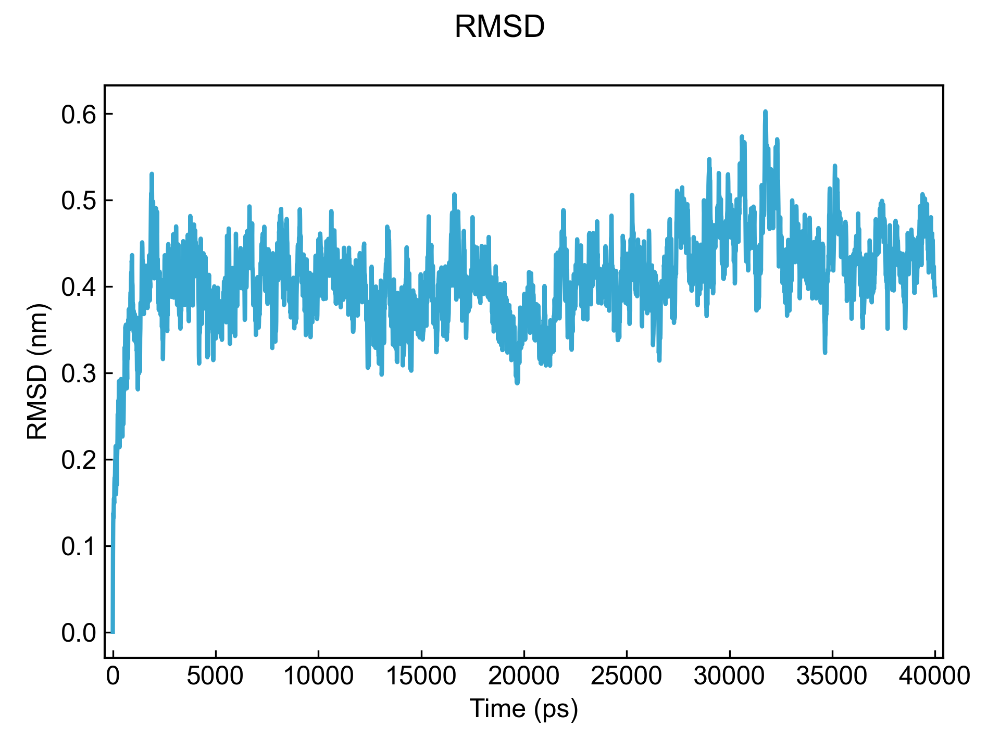


### xvg_compare

Compared to `xvg_show`, I highly recommend using `xvg_compare`. Even if you don't need data comparison, this command offers greater flexibility.

`xvg_compare` takes one or more files and a set of column indices, then plots all the indexed data.

```bash
dit xvg_compare -f rmsd.xvg gyrate.xvg -c 1 1,2
```

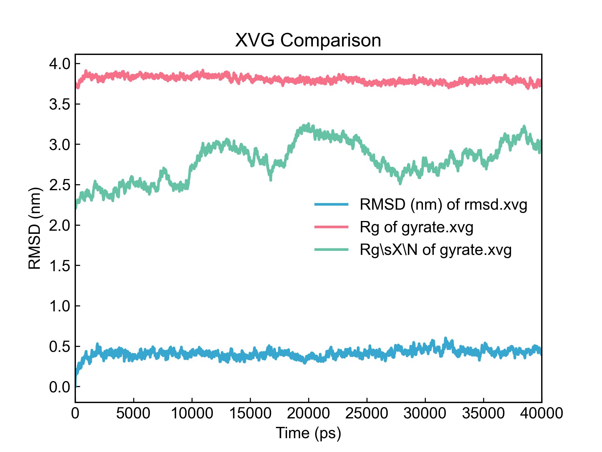

The indexing might seem strange - why `1 1,2`? Here we have two indices (one index is 1, another is the index group 1,2). Since two files were provided, the number of indices (index groups) must match the number of files. Indices (index groups) are separated by spaces. Within an index group like `1,2`, indices are separated by commas. The first index `1` corresponds to the first file's first column (RMSD). The second index group `1,2` corresponds to the second file, i.e., Rg and RgX columns from Gyrate data.

This indexing method allows selecting different columns from each input file for comparison.

Note that column 0 of input files doesn't need to be identical. Line plots use each file's column 0 as X values. RMSD's column 1 uses rmsd.xvg's column 0 as X values, while Gyrate's columns 1,2 use gyrate.xvg's column 0 as X values.

`xvg_compare` has other parameters. While legend, xlabel, ylabel are automatically parsed, you can manually specify them.

The `-l` parameter sets legends. The number of parameters must match the number of selected columns. Currently, spaces in legends are not supported (spaces separate different legends).

```bash
dit xvg_compare -f rmsd.xvg gyrate.xvg -c 1 1,2 -l RMSD gyrate gyrate_X -x Time(ns) -y (nm) -t hhh
```

You can also use `-s` and `-e` (start and end) to set the data range for each column. For example, `-s 10 -e 100` means using only the 11th to 100th (inclusive) data points from each column.

This method also includes a moving average option - just declare `-smv`. Moving average has two parameters: windowsize and confidence, defaulting to 50 and 0.9, which you can customize.

```bash
dit xvg_compare -f energy.xvg -c 1,3 -l LJ(SR) Coulomb(SR) -smv
```

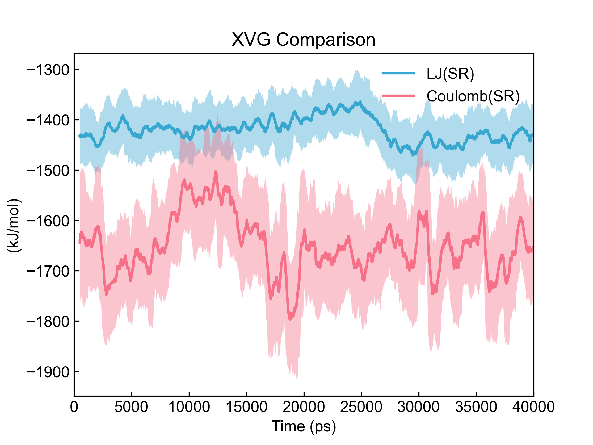

Moving average calculation is currently a bit slow and will be optimized later.


### xvg_ave

`xvg_ave` calculates the average of each column. You can specify start and end rows. Useful for calculating averages during equilibrium periods.

```bash
$ dit xvg_ave -f rmsd.xvg -s 2000 -e 4000
Info -> read rmsd.xvg successfully.

                       Time (ps)       RMSD (nm)
             ave      29995.0000          0.4281
             std       5773.5020          0.0473
```

Note that the starting row specified by `-s` is included in calculations, while the row specified by `-e` is not. To calculate to the end, only specify `-s`. For example, if rmsd.xvg has 4000 rows, `-e 4000` only calculates from row 2000 to 3999. Remember, DIT's column and row counting starts from 0.


### xvg_mvave

Given an xvg file, calculates moving average for each column and outputs to a CSV file.


### xvg2csv

Converts xvg data files to CSV files. Just specify input and output files.


### xvg_rama

The `gmx rama` command produces protein dihedral angle (phi and psi) data. `xvg_rama` converts this data to Ramachandran plots. Most of this code is borrowed from the PyRAMA project.

```bash
dit xvg_rama -f rama.xvg
```

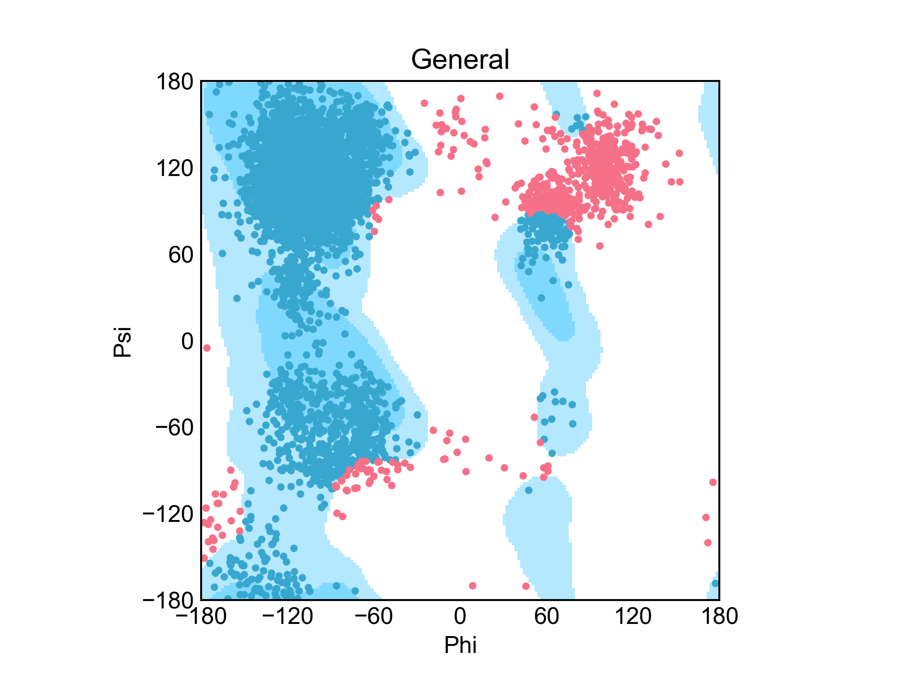


### xvg_show_distribution

While `xvg_show` displays data changes, `xvg_show_distribution` shows data distribution. Multiple columns are plotted as subplots.

```bash
dit xvg_show_distribution -f gyrate.xvg
```

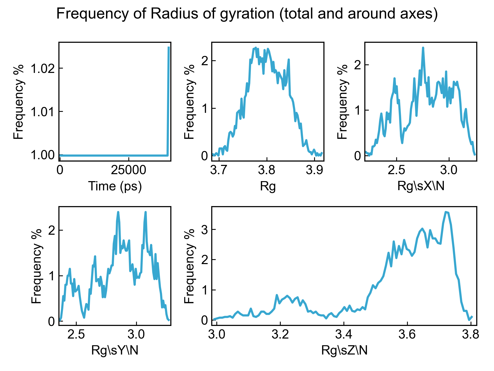

Use the `-bin` parameter to define the number of distribution bins (default: 100). The maximum value falls into the largest bin, causing the small uptick at the end of the time distribution in the first plot.


### xvg_show_stack

`xvg_show_stack` primarily draws **stacked area plots**. Useful for plotting protein secondary structure content changes from `do_dssp` output.

```bash
dit xvg_show_stack -f dssp_sc.xvg -c 2 3 4 5 6 
```

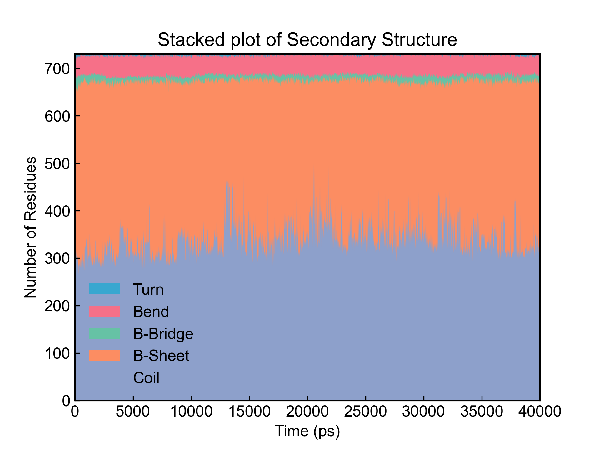

Use `-c` parameter to specify columns to stack. The program automatically creates stacked plots from selected columns.


### xvg_show_scatter

As the name suggests, `xvg_show_scatter` creates scatter plots. Use `-xi` and `-yi` to specify two columns for X and Y values.

```bash
dit xvg_show_scatter -f rama.xvg -xi 0 -yi 1
```


### xvg_energy_compute

For intermolecular interactions calculated using the interaction principle (Interaction Energy = Complex Energy - Molecule A Energy - Molecule B Energy), this command helps automate the process.

Input three files: complex energy file, molecule A energy file, molecule B energy file. Each file should contain exactly five columns (time, LJ(SR), Disper.corr., Coulomb(SR), Coul.recip.) in order. The script reads these files, performs calculations, and outputs results to an xvg file.

```bash
dit xvg_energy_compute -f prolig.xvg pro.xvg lig.xvg -o results.xvg
```

Note: For more accurate results, consider using energy groups with extended cutoff in a rerun simulation.


### xvg_combine

`xvg_combine` has similar input to `xvg_compare` with similar functionality. While `xvg_compare` plots selected data, `xvg_combine` outputs selected data to a new xvg file.

```bash
dit xvg_combine -f f1.xvg f2.xvg -c 1,2 2,3 -o res.xvg
```


### xvg_ave_bar

`xvg_ave_bar` is complex and requires detailed explanation.

Consider this scenario: You simulated three different ligands with a protein, each with three parallel simulations, giving you 9 trajectories and 9 xvg files of hydrogen bond counts over time. Now you need to calculate average hydrogen bonds for the equilibrium period of each simulation, then compare between systems.

The typical approach: First calculate the average hydrogen bond count for each xvg file during equilibrium (9 averages total). Then calculate the mean and error for parallel simulations within each system. Finally, create a bar chart with averages and errors for the three systems.

That's exactly what `xvg_ave_bar` does.

Example:

```bash
dit xvg_ave_bar -f f1_1.xvg,f1_2.xvg,f1_3.xvg f2_1.xvg,f2_2.xvg,f2_3.xvg -c 2 3 5 -l A B -y number
```

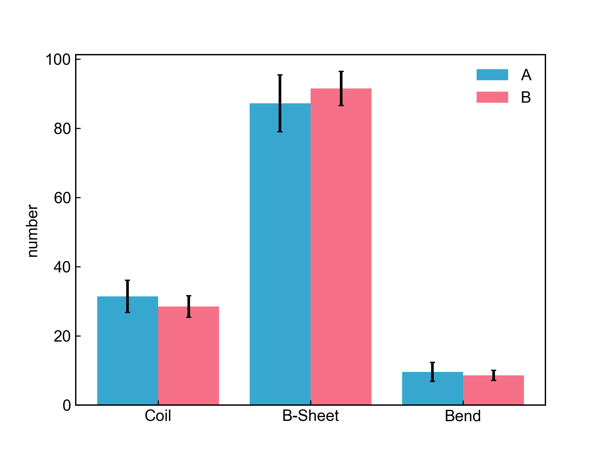

The above figure shows secondary structure content for two systems (each with three parallel simulations).

First, the `-f` parameter: reads several file groups separated by spaces. Each file group represents one system. Within each group, files are separated by commas, representing parallel simulations of one system. The program automatically calculates mean and error for parallel simulations within each file group, then plots comparisons between groups.

The `-c` parameter selects columns to compare. This applies to every file. Here, columns 2, 3, 5 from each file are plotted, giving three X values on the final figure.

The `-l` parameter manually specifies legends. The number must match the number of file groups!

The `-xt` parameter specifies content displayed on the X-axis, with quantity matching selected columns.

You can also specify xlabel, ylabel, title, and data range.

Note: The `-ac` parameter, combined with `-o` for output filename, saves calculated averages and errors to a file (default is screen output).


### xvg_box

`xvg_box` creates box plots to compare data distributions.

```bash
dit xvg_box -f f1.xvg f2.xvg -c 1 2 3 -xt Rg Rg_x Rg_y
```

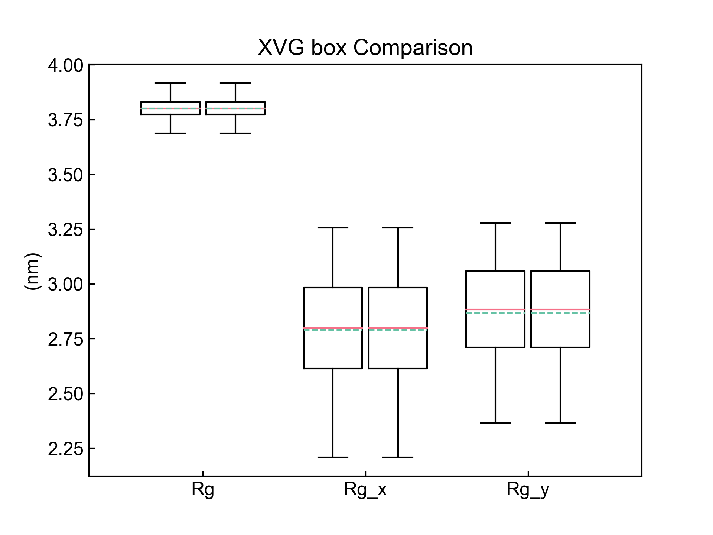

The `-f` parameter specifies files, `-c` selects columns (applied to all specified files), and box plots are generated.

Note: Each xvg file's corresponding columns should represent the same thing (e.g., column 1 in all files is Rg, followed by Rg_x and Rg_y). The program doesn't verify correspondence.

The `-xt` parameter declares values shown on the X-axis, with quantity matching `-c`. You can also specify xlabel etc.

This feature is rarely used and was written hastily.


## XPM

The XPM module contains 3 commands for processing XPM files, all starting with `xpm`.


### xpm_show

`xpm_show` visualizes xpm files. `-ip` specifies interpolation, `-pcm` uses pcolormesh function, `-3d` draws 3D plots, `-o` saves image files, `-ns` doesn't show the image.

```bash
dit xpm_show -f test.xpm -ip
```

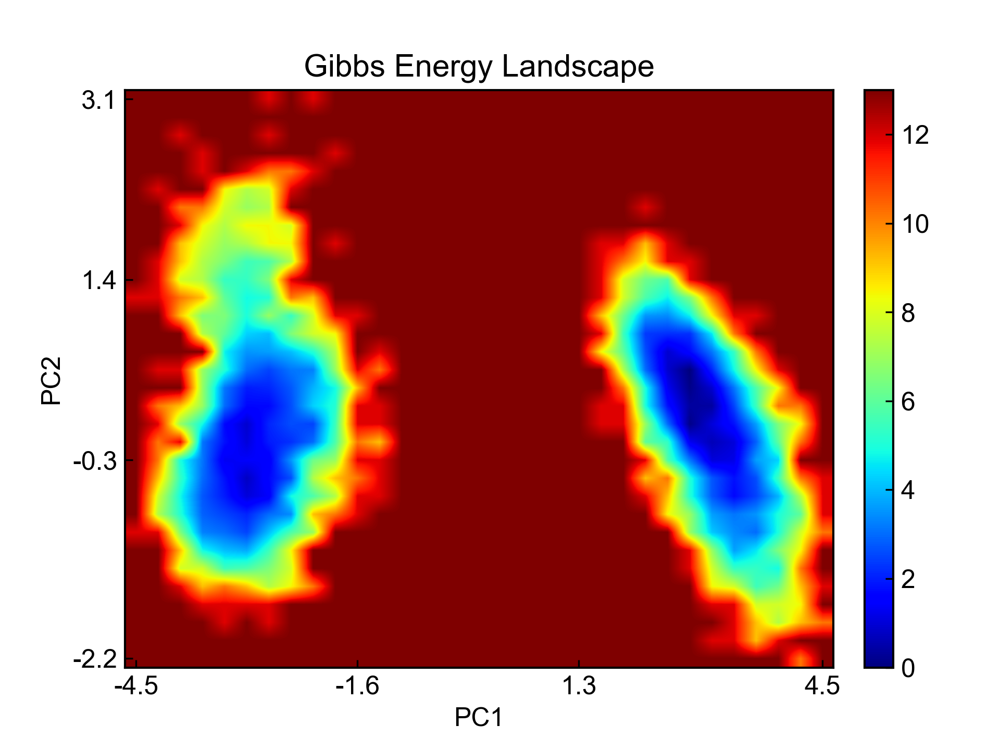

```bash
dit xpm_show -f test.xpm -3d
```

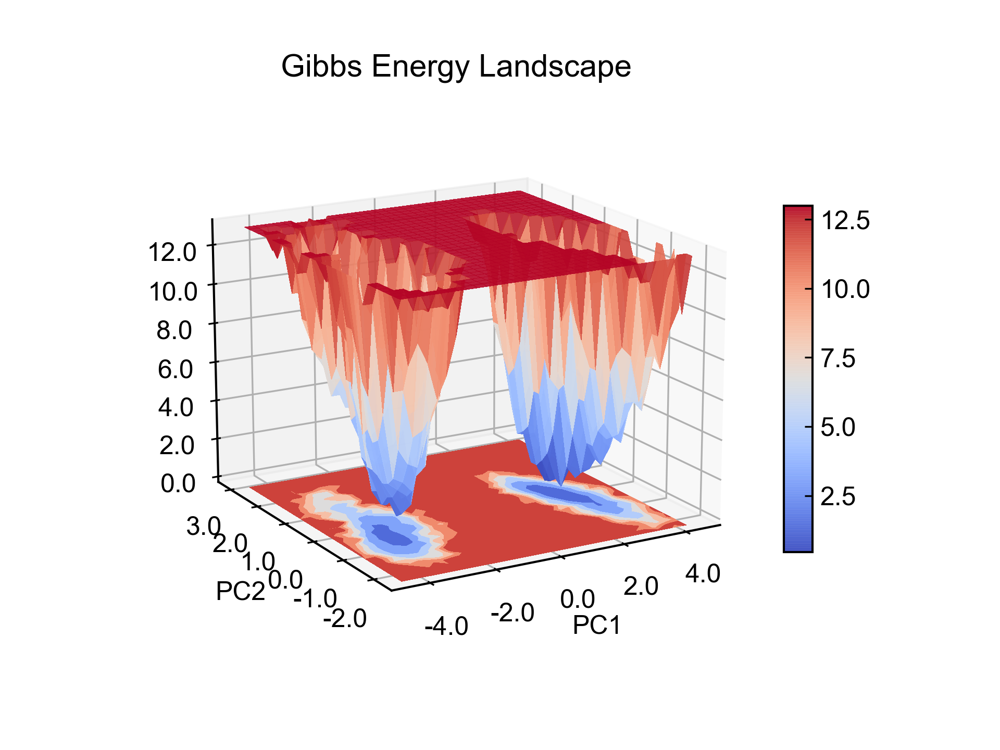

Almost all XPM files generated by GMX can be visualized with `xpm_show`, including DSSP and hbmap images.


### xpm2csv

`xpm2csv` converts xpm files to CSV format with three columns (x, y, v) - horizontal coordinate, vertical coordinate, and pixel value.

```bash
dit xpm2csv -f test.xpm -o test.csv
```


### xpm2gpl

Gnuplot is an excellent plotting software that uses scripts for plotting. `xpm2gpl` converts xpm files to gnuplot plotting scripts (gpl files). Gnuplot produces beautiful protein secondary structure change plots.

```bash
dit xpm2gpl -f test.xpm -o test.gpl
```

### xpm2dat

Converts xpm files to M×N dat files. Currently only supports Continuous data type xpm files. The first line is a comment with titles for the first row (xaxis), second row (yaxis), and M×N matrix. The first row contains xaxis data (xpm image's x-axis). The second row contains yaxis data (xpm image's y-axis), ordered from bottom to top. Subsequent rows are M×N matrix data, with order matching the xpm file.

```bash
dit xpm2dat -f test.xpm -o test.dat
```


## NDX

The NDX module contains 7 commands starting with `ndx` for processing ndx files.

**I recommend using GROMACS's `make_ndx` command for processing ndx files - it's more feature-rich and user-friendly.**

### ndx_show

`ndx_show` outputs names of all index groups in an ndx file.

```bash
dit ndx_show -f test.ndx
```


### ndx_rm_dup

`ndx_rm_dup` removes all duplicate index groups from an ndx file. Duplicate means both the name and indices are identical.

```bash
dit ndx_rm_dup -f test.ndx -o res.ndx
```


### ndx_rm

`ndx_rm` removes certain index groups from an ndx file. Use `-gl` parameter to specify group names to remove. You can also use `-int` for interactive mode to decide whether to delete each group.

```bash
dit ndx_rm -f test.ndx -o res.ndx -gl Protein Ligand
dit ndx_rm -f test.ndx -o res.ndx -int
```


### ndx_preserve

`ndx_preserve` is similar to `ndx_rm`, but selected index groups are preserved while unselected ones are deleted. Also has interactive mode.


### ndx_add

`ndx_add` adds an index group to an ndx file. Use `-gn` for group name, and `-s`, `-e`, `-t` for start, end, and step of index numbers (similar to Python's range function).

```bash
dit ndx_add -f test.ndx -o res.ndx -gn hhh -s 10 -e 100 -t 2
```

The above command adds a group named "hhh" with even numbers from 10 to 99 (inclusive). `-t` is optional, default step is 1.

Sometimes useful for manually creating index groups (e.g., for dPCA).


### ndx_combine

`ndx_combine` combines several index groups into a new one. Specify `-gn` and `-gl` parameters.


### ndx_rename

`ndx_rename` renames index groups. Use `-int` for interactive mode, or specify old name `-on` and new name `-nn`.


## MDP

The MDP module has only one command.

### mdp_gen

`mdp_gen` generates a template mdp file in the current directory. The `-a` parameter specifies the file's purpose, generating different content. Currently accepts: ions, em, nvt, npt, md, blank.

```bash
dit mdp_gen -o npt.mdp -a npt
```

**Note: The generated mdp template may not suit your system. Please review and adjust parameters after generation.** This command just saves you from copying mdp files around.

These mdp template files are stored in the data folder of the DuIvyTools package. You can modify them directly as needed.

This feature will continue to be optimized. The goal is to collect mdp files for different simulation purposes for everyone's convenience.


## Other Modules

### show_style

```bash
dit show_style
```

The `show_style` command was added in v0.4.7. It generates DIT's default matplotlib style sheet in the current working directory for user customization.

For matplotlib style parameters, see: https://matplotlib.org/stable/tutorials/introductory/customizing.html#the-matplotlibrc-file

You can also place your own .mplstyle file in the current directory - DIT will prioritize it for plotting.


### find_center

```bash
find_center: to find the atom which is nearest to center of atom group.

:examples:
    dit find_center -f test.gro
    dit find_center -f test.gro -n index.ndx
    dit find_center -f test.gro -n index.ndx -aa

:parameters:
    -f, --input
            the gro file which contains one frame of molecule coordinates
    -n, --index
            the index file which you could select group from
    -aa, --AllAtoms
            if to find center of one group atoms in all atoms
```

`find_center` finds the geometric center of atom groups in gro files.

Users can specify an index file and index group to find the center of a specific group. Without an index file, it finds the center of all atoms in the gro file.

The `-aa` parameter searches for the nearest atom to the center from all atoms, not just the specified group, since the nearest atom might not belong to that group.


### pipi_dist_ang

```bash
pipi_dist_ang: to calculate the distance and angles between two rings or between one ring and one vector defined by atom group or command line.

:examples:
    dit pipi_dist_ang -f test.gro -n test.ndx
    dit pipi_dist_ang -f test.gro -n test.ndx -select ring1 ring2
    dit pipi_dist_ang -f test.gro -n test.ndx -select ring1 -vg
    dit pipi_dist_ang -f test.gro -n test.ndx -select ring1 -vec 6 6 6

:parameters:
    -f, --input
            the gro file which contains frames of molecule coordinates
    -n, --index
            the index file which contains atom index groups of rings or vector groups
    -b
            the frame number to start calculation, default=0
    -dt
            the frame interval, default=1
    -o, --output
            the output filename to save results
    -vg
            whether to get vector from index group, default=False
    -vec
            specify the vector by command line, eg. -vec 6 6 6
    -select
            select the groups from command line
```

`pipi_dist_ang` calculates the geometric center distance and normal vector angles between two rings (5-7 membered).

Users define rings by creating atom groups in an index file with atom indices. DIT reads the specified indices, calculates geometric centers and normal vectors, then derives distances and angles.

This command also supports custom vectors to calculate angles between ring normals and specified vectors. Use `-vec` parameter in command line, or create a two-atom group in the index file to form a vector.


### hbond

```bash
hbond: A useful method to process hbond related files generated by `gmx hbond`,
        you can get hbond occupancy figure and table infos from `dit hbond`. 
        note: the hbond names will show on figure only when number of hbonds 
              less than 10. 

:examples:
    dit hbond -f md.gro -n hbond.ndx -m hbmap.xpm 
    dit hbond -f md.gro -n hbond.ndx -m hbmap.xpm -c 5 7 
    dit hbond -f md.gro -n hbond.ndx -m hbmap.xpm -c 5 7 0-3
    dit hbond -f md.gro -n hbond.ndx -m hbmap.xpm -o test.png -csv test.csv -ns
    dit hbond -f md.gro -n hbond.ndx -m hbmap.xpm -hnf d_resname(d_resnum)@d_atomname(d_atomnum)->h_atomname(h_atomnum)...a_resname(a_resnum)@a_atomname(a_atomnum) 
    dit hbond -f md.gro -n hbond.ndx -m hbmap.xpm -hnf "d_resname@d_atomname -> h_atomname ... a_resname@a_atomname" 
    dit hbond -f md.gro -n hbond.ndx -m hbmap.xpm -hnf "d_atomname@h_atomname -> a_atomname" 
    dit hbond -f md.gro -n hbond.ndx -m hbmap.xpm -hnf "number" 
    dit hbond -f md.gro -n hbond.ndx -m hbmap.xpm -hnf id -so AND0,2,5-7
    dit hbond -f md.gro -n hbond.ndx -m hbmap.xpm -hnf id -so OR0,2,5-7

:parameters:
    -f, --input
            the gro file which contains one frame of molecule coordinates, 
            used to get atom names.
    -n, --index
            the index file generated by `gmx hbond`
    -m, --map
            the hbond map file (hbmap.xpm) generated by `gmx hbond`
    -c, --select (optional)
            select the hbond id to only show the selected hbonds
    -o, --output (optional)
            the figure name you want to save
    -csv, --csv (optional)
            save the table infos into a csv whose name is specified here
    -ns, --noshow (optional)
            whether not to show figure, useful on computer without gui
    -hnf, --hbond_name_format (optional)
            define the hbond name format by user! 
            Each atom has four features: resname, resnum, atomname, atomnum. 
            Distinguish donor, hydrogen, acceptor by adding one prefix to each
            feature, like: d_resname, a_resnum, h_atomname. So you may able to
            define hbond name style by: 
            'd_resname(d_resnum)@d_atomname(d_atomnum)->h_atomname(h_atomnum)...a_resname(a_resnum)@a_atomname(a_atomnum)' 
            which is the default style, or also you could specify 
            'd_atomname@h_atomname...a_atomname' 
            or some format you would like.
            Or you could just set hnf to be 'number' or 'id' to show hbond id on figure
    -genscript, --genscript (optional)
            whether to generate scripts for calculating distance and angle of hbonds
    )
    -cda, --calc_distance_angle (optional)
            whether to calculate distance and angle of hbonds from distance xvg file and angle xvg file
    -distancefile, --distancefile (optional)
            distance file of hbonds for input
    -anglefile, --anglefile (optional)
            angle file of hbonds for input
    -xs, --xshrink (optional)
            specify a factor for multiplication of x-axis. default == 1.0
            For instance, if "-xs 0.001" is specified, all x-axis value of xvg
            will multiply this value. x-axis 1000 will be shown as 1. 
            Useful for converting the unit (ps) of time into (ns). Don't forget
            to change xlabel too after specifing -xs.
    -x, --xlabel (optional)
            specify the xlabel of figures
    -so, --set_operation (optional)
            use AND or OR to perform set operation on hbonds, eg. `AND1,2,5-6`  
            or `OR0,2-4,7`. The AND set or OR set of hbonds whose ids were after
            key words will be calculated and shown in occupancy figure.  
```

The `hbond` command generates hydrogen bond occupancy figures and provides occupancy information.

After `gmx hbond` completes, it generates an index file, an xvg file of hydrogen bond counts, and an xpm file of hydrogen bond occupancy. The `dit hbond` command needs a gro file, the hydrogen bond index file, and the hydrogen bond xpm file. The index and gro files provide atom names, while the xpm file contains occupancy information.

Users can customize hydrogen bond name format via `-hnf`. Each atom has four properties: `resname`, `resnum`, `atomname`, `atomnum`. Prefixes `d_`, `a_`, `h_` represent donor, acceptor, and hydrogen. Combine these keywords to define your format. Setting `-hnf` to `number` or `id` displays hydrogen bond IDs instead.

`-genscript`, `-cda`, `-distancefile`, and `-anglefile` are for calculating **hydrogen bond angles and distances**.

Usage steps:
1. Run `gmx hbond` with `-merge no` to prevent merging different hydrogen atoms on the same donor
2. Run `dit hbond` with `-genscript` to generate scripts and index files for distance/angle calculations
3. Run the generated scripts (run_hbdist.sh and run_hbang.sh) with gmx to create distance and angle xvg files
4. Run `dit hbond` with `-cda`, `-distancefile`, and `-anglefile` to get distance/angle plots and statistics

Output figures:

Hydrogen bond occupancy:
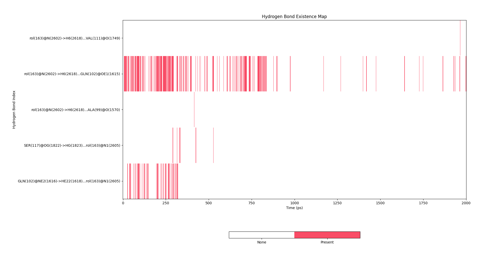

Hydrogen bond distance over time:
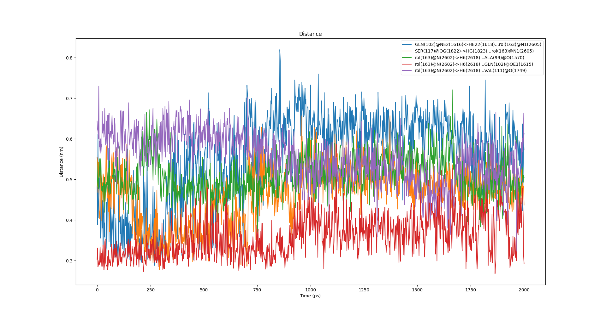

Hydrogen bond angle over time:
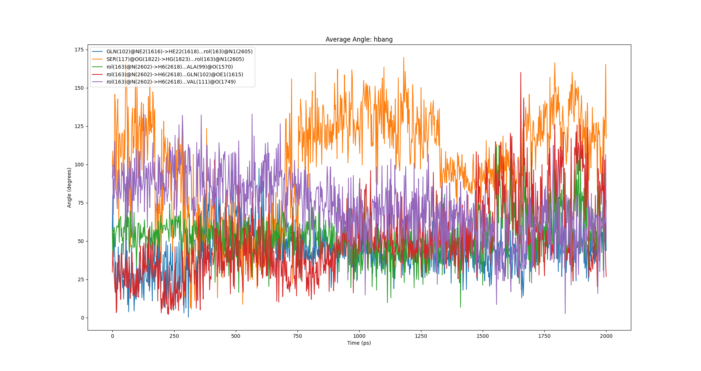

Table output:
```bash
-------------------------------------------------------------------------------------------------------------------
id donor->hydrogen...acceptor                           occupancy(%) Present/Frames   Distance (nm)       Angle (°)
-------------------------------------------------------------------------------------------------------------------
0  GLN(102)@NE2(1616)->HE22(1618)...rol(163)@N1(2605)           4.60     46/1001     0.3219 ± 0.0167  17.91 ± 7.05
1  SER(117)@OG(1822)->HG(1823)...rol(163)@N1(2605)              0.60      6/1001     0.3102 ± 0.0218  12.75 ± 5.86
2  rol(163)@N(2602)->H6(2618)...ALA(99)@O(1570)                 0.10      1/1001     0.3400 ± nan     23.03 ± nan
3  rol(163)@N(2602)->H6(2618)...GLN(102)@OE1(1615)             18.98    190/1001     0.3088 ± 0.0175  20.56 ± 7.38
4  rol(163)@N(2602)->H6(2618)...VAL(111)@O(1749)                0.10      1/1001     0.3230 ± nan     15.73 ± nan
-------------------------------------------------------------------------------------------------------------------
```

The `dit hbond` command also supports set operations on hydrogen bond occupancy. Calculate occupancy where **multiple hydrogen bonds exist simultaneously** (AND) or **any of multiple hydrogen bonds exist** (OR) via `-so` parameter. Format: `AND2,4-6,7` or `OR0-4,6`.

Examples:
```bash
dit hbond -f test.gro -n hbond.ndx -m hbond.xpm -hnf id
```

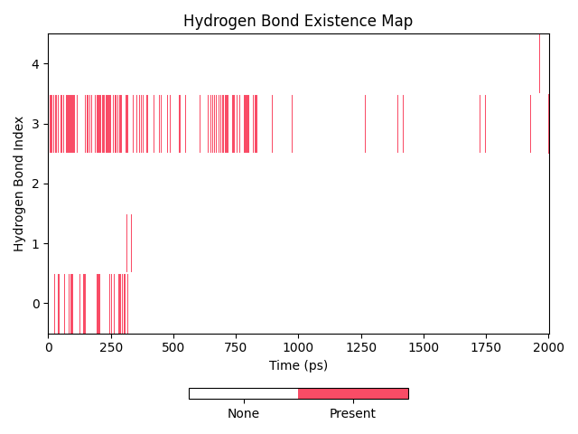

```bash
dit hbond -f test.gro -n hbond.ndx -m hbond.xpm -hnf id -so AND0,3
```

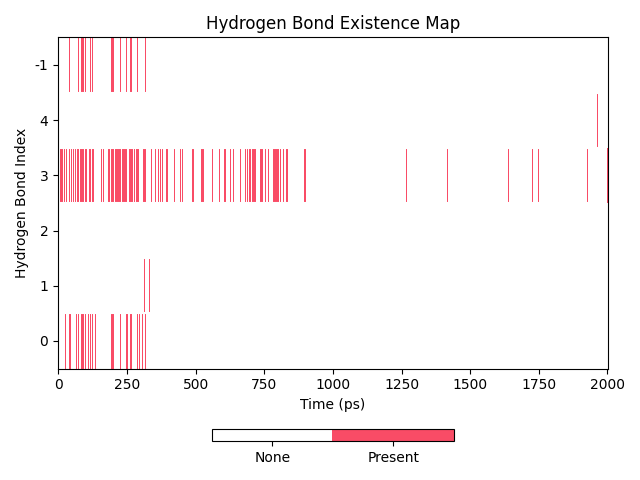

The -1 in the figure represents the set operation result. Without `-hnf id`, it shows `AND0,3`.

```bash
dit hbond -f test.gro -n hbond.ndx -m hbond.xpm -hnf id -so OR0-2,4
```

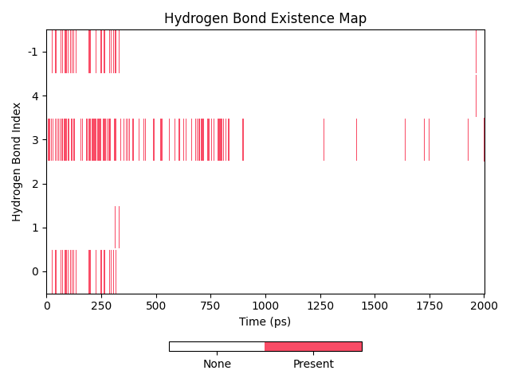

**DuIvy has developed an automated simulation analysis software DuIvyProcedures with automated hydrogen bond processing tools: https://duivyprocedures-docs.readthedocs.io/en/latest/**

### dssp

The `dssp` command processes xpm files from `gmx do_dssp`. Three functions:
1. Plot the xpm file (also possible via `dit xpm_show`)
2. Plot residue secondary structure content over time (can also use `dit xvg_show_stack` with the secondary structure content file from `gmx do_dssp`). Also generates residue_occupancy_data.csv
3. Plot time secondary structure content over residue (time fraction of each residue's secondary structure during sampling). Also generates time_occupancy_data.csv

```bash
dssp: read in one xpm of secondary structure file, output the DSSP plot, 
      residue occupancy vs time figure, time occupancy vs residue figure. 

:examples:
    dit dssp -f dssp.xpm 
    dit dssp -f dssp.xpm -xs 0.001 -x Time(ns)

:parameters:
    -f, --input 
            input xpm of secondary structure
    -x, --xlabel (optional)
            specify the xlabel of xpm
    -y, --ylabel (optional)
            specify the ylabel of xpm
    -t, --title (optional)
            specify the title of xpm
    -xs, --xshrink (optional)
            specify a factor for multiplication of x-axis. default == 1.0
```

Example:
```bash
dit dssp -f dssp.xpm -xs 0.001 -x Time(ns)
```

First, the xpm visualization:
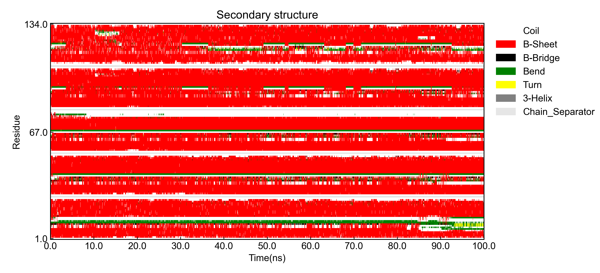

Then, residue secondary structure content over time:
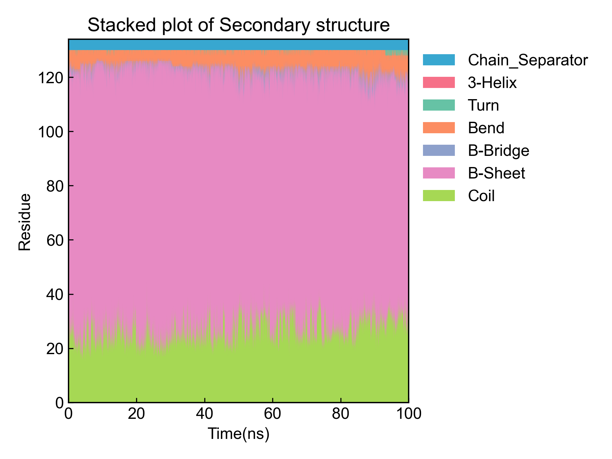

Finally, time secondary structure content over residue:
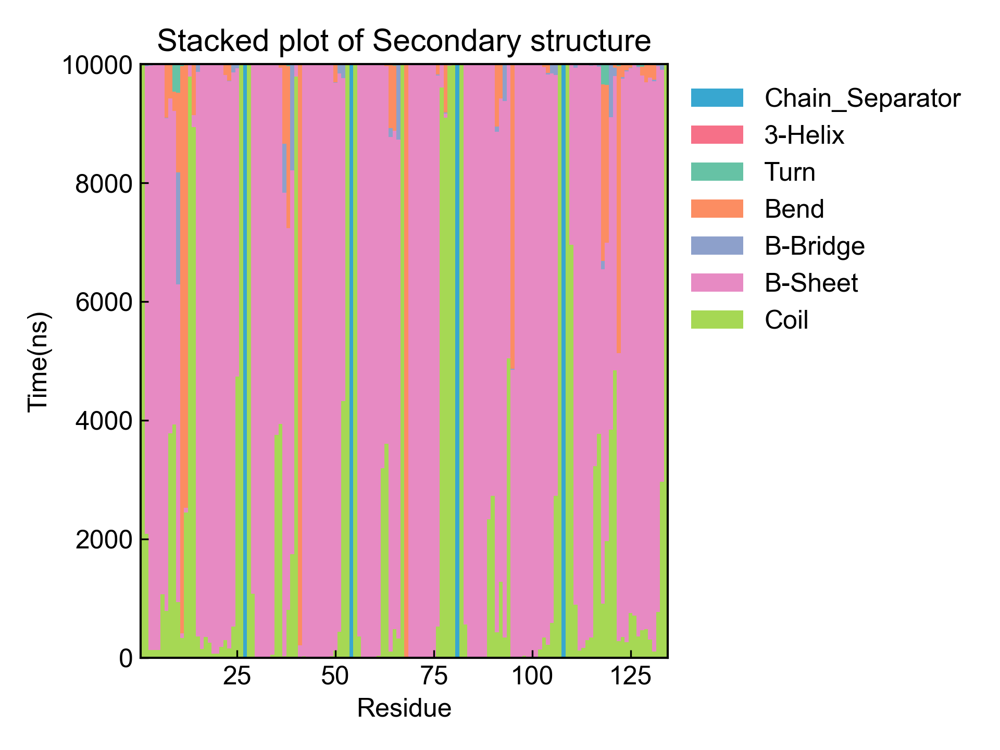


### mol_map

**Not recommended - still has algorithmic issues to resolve.**

If two molecules have identical conformations but different atomic coordinates, this command can transform coordinates from one molecule to another.


### dccm_ascii

```bash
dccm_ascii: generate dynamic cross correlation matrix (DCCM) from dat file
            generated by `gmx covar`.

:examples:
    dit dccm_ascii -f covapic.dat
    dit dccm_ascii -f covapic.dat -m gaussian -o res.png -noshow
    dit dccm_ascii -f covapic.dat -x Res -y Res -t DCCM

:parameters:
    -f, --input
            the dat file generated by `gmx covar` which stored the covarience
            matrix information
    -o, --output
            specify the output figure name
    -m, --mode
            specify the figure style, "origin", "gaussian", "bio3d"(default)
    -ns, --noshow
            whether not to show figure
    -x, --xlabel
            specify the xlabel of figure
    -y, --ylabel
            specify the ylabel of figure
    -t, --title
            specify the title of figure
```

`dccm_ascii` converts the covariance matrix dat text file from `gmx covar` to a dynamic cross-correlation matrix. Three plotting styles available: `origin`, `gaussian`, and `bio3d` (matplotlib imitation of bio3d style).


### show_style

Use `show_style` to generate DIT's current plotting style file in the working directory. Modify it to control plot formatting (fonts, sizes, etc.).


## Future Features

After v0.4.8, only bug fixes will be released. Since releasing DIT in March 2022, the author has found the early design logic increasingly unwieldy. Expected features weren't so numerous, so core functions weren't written cleanly enough, making later additions difficult and correctness hard to ensure.

Therefore, after v0.4.8, development of v0.5.0 begins with complete restructuring. Priorities include:
1. Independent file parsing and data conversion modules
2. Redesigned command-line parameters
3. Additional plotting engines (plotext, gnuplot, etc.) beyond matplotlib
4. Support for analysis workflows
5. More detailed help information and documentation
6. Better command-line output
7. Comprehensive unit testing
8. Support for residue contact matrices
9. ...


## Cite DuIvyTools

> DuIvyTools is open-source under GPLv3 license. Free to use and modify for academic and personal purposes. **Commercial use is prohibited.**

Cite DuIvyTools by:

[](https://doi.org/10.5281/zenodo.6339993)
