# DuIvyTools v0.6.0


Welcome to DuIvyTools documentation! DuIvyTools (DIT) is a command-line based MD analysis tool for quick visualization and analysis of GROMACS result files.


## What's New in v0.6.0

Compared to v0.5.0, v0.6.0 includes the following updates and improvements:

1. Added `-xp`, `-yp`, `-zp` parameters for data addition/subtraction operations, allowing custom axis tick labels.
2. Added `--legend_ncol` parameter to specify the number of legend columns (matplotlib only).
3. Added `figure.figsize` parameter in DIT.mplstyle for custom figure size.
4. Added `--x_numticks`, `--y_numticks`, `--z_numticks` parameters to specify the number of axis tick labels (matplotlib only).
5. Improved support for xvg files without column names; DIT now automatically processes them as numeric data.
6. Fixed confidence interval calculation bugs; `-smv` now accepts parameters to show original data as background by default, or confidence interval with `-smv CI`.
7. Fixed various minor issues.


If you encounter any problems or have questions while using DIT, please create a new topic in the DuIvy Feishu (Lark) group for discussion. For urgent issues, you can also contact the author through the DuIvy WeChat official account.


## Installation

DIT can be installed from source (https://github.com/CharlesHahn/DuIvyTools) or via `pip`:

```bash
pip install DuIvyTools
```

For slower connections, use Chinese mirrors such as Tsinghua:

```bash
pip install DuIvyTools -i https://pypi.tuna.tsinghua.edu.cn/simple
```


## Help Information

DIT is a command-line based tool. Users enter commands to process and visualize data.

Type `dit` to see all available commands:

```bash
 *******           **                  **********               **
/**////**         /**          **   **/////**///               /**
/**    /** **   **/** **    **//** **     /**  ******   ****** /**  ******
/**    /**/**  /**/**/**   /** //***      /** **////** **////**/** **////
/**    /**/**  /**/**//** /**   /**       /**/**   /**/**   /**/**//*****
/**    ** /**  /**/** //****    **        /**/**   /**/**   /**/** /////**
/*v0.6.0  //******/**  //**    **         /**//****** //****** *** ******
///////    ////// //    //    //          //  //////   ////// /// //////

DuIvyTools is a simple analysis and visualization tool for GROMACS result files written by 杜艾维 (https://github.com/CharlesHahn/DuIvyTools).

DuIvyTools provides about 30 commands for visualization and processing of GMX result files like .xvg or .xpm.

All commands are shown below:
XVG:
    xvg_show              : easily show xvg file
    xvg_compare           : visualize xvg data
    xvg_ave               : calculate the averages of xvg data
    xvg_energy_compute    : calculate eneries between protein and ligand
    xvg_combine           : combine data of xvg files
    xvg_show_distribution : show distribution of xvg data
    xvg_show_scatter      : show xvg data by scatter plot
    xvg_show_stack        : show xvg data by stack area plot
    xvg_box_compare       : compare xvg data by violin and scatter plots
    xvg_ave_bar           : calculate and show the averages of parallelism
    xvg_rama              : draw ramachandran plot from xvg data
XPM:
    xpm_show              : visualize xpm data
    xpm2csv               : convert xpm data into csv file in form (x, y, z)
    xpm2dat               : convert xpm data into dat file in form (N*N)
    xpm_diff              : calculate the difference of xpms
    xpm_merge             : merge two xpm by half and half
Others:
    mdp_gen               : generate mdp file templates
    show_style            : show figure control style files
    find_center           : find geometric center of one group of atoms
    dccm_ascii            : convert dccm from ascii data file to xpm
    dssp                  : generate xpm and xvg from ascii file of gmx2023
    ndx_add               : new a index group to ndx file
    ndx_split             : split one index group into several groups
    ndx_show              : show the groupnames of index file

You can type `dit <command> -h` for detailed help messages about each command, like: `dit xvg_show -h`.

All possible parameters could be inspected by `dit -h` or `dit --help`.

Cite DuIvyTools by DOI at https://doi.org/10.5281/zenodo.6339993

Have a good day !
```

Use `dit -h` to see all parameters, and `dit <command> -h` for specific command information.


## Command Line Parameters

Type `dit -h` to view all parameters:

```bash
DuIvyTools: A Simple MD Analysis Tool

positional arguments:
  cmd                   command of DIT to run

options:
  -h, --help            show this help message and exit
  -f INPUT [INPUT ...], --input INPUT [INPUT ...]
                        specify the input file or files
  -o OUTPUT, --output OUTPUT
                        specify the output file
  -ns, --noshow         not to show figure
  -c COLUMNS [COLUMNS ...], --columns COLUMNS [COLUMNS ...]
                        select the column indexs for visualization or
                        calculation, or input numerical list
  -l LEGENDS [LEGENDS ...], --legends LEGENDS [LEGENDS ...]
                        specify the legends of figure or data
  -b BEGIN, --begin BEGIN
                        specify the index for beginning (include)
  -e END, --end END     specify the index for ending (not include)
  -dt DT, --dt DT       specify the index step, default to 1
  -x XLABEL, --xlabel XLABEL
                        specify the xlabel of figure or data
  -y YLABEL, --ylabel YLABEL
                        specify the ylabel of figure or data
  -z ZLABEL, --zlabel ZLABEL
                        specify the zlabel of figure or data
  -t TITLE, --title TITLE
                        specify the title of figure or data
  -xmin XMIN, --xmin XMIN
                        specify the X value limitation, x_min
  -xmax XMAX, --xmax XMAX
                        specify the X value limitation, x_max
  -ymin YMIN, --ymin YMIN
                        specify the Y value limitation, y_min
  -ymax YMAX, --ymax YMAX
                        specify the Y value limitation, y_max
  -zmin ZMIN, --zmin ZMIN
                        specify the Z value limitation, z_min
  -zmax ZMAX, --zmax ZMAX
                        specify the Z value limitation, z_max
  --x_precision X_PRECISION
                        specify the precision of X values for visualization
  --y_precision Y_PRECISION
                        specify the precision of Y values for visualization
  --z_precision Z_PRECISION
                        specify the precision of Z values for visualization
  -xs XSHRINK, --xshrink XSHRINK
                        modify X values by multipling xshrink, default to 1.0
  -ys YSHRINK, --yshrink YSHRINK
                        modify Y values by multipling yshrink, default to 1.0
  -zs ZSHRINK, --zshrink ZSHRINK
                        modify Z values by multipling zshrink, default to 1.0
  -xp XPLUS, --xplus XPLUS
                        modify X values by plusing xplus, default to 0.0
  -yp YPLUS, --yplus YPLUS
                        modify Y values by plusing yplus, default to 0.0
  -zp ZPLUS, --zplus ZPLUS
                        modify Z values by plusing zplus, default to 0.0
  --x_numticks X_NUMTICKS
                        specify the xtick number for visualization
  --y_numticks Y_NUMTICKS
                        specify the ytick number for visualization
  --z_numticks Z_NUMTICKS
                        specify the ztick number for visualization
  -smv [{,CI,origin}], --showMV [{,CI,origin}]
                        whether to show moving averages of data, default is
                        no; if '-smv' is set, the original data will be shown as
                        background; 'CI' for showing the moving averages with
                        confidence interval
  -ws WINDOWSIZE, --windowsize WINDOWSIZE
                        window size for moving average calculation, default to
                        50
  -cf CONFIDENCE, --confidence CONFIDENCE
                        confidence for confidence interval calculation,
                        default to 0.95
  --alpha ALPHA         the alpha of figure items
  -csv CSV, --csv CSV   store data into csv file
  -eg {matplotlib,plotext,plotly,gnuplot}, --engine {matplotlib,plotext,plotly,gnuplot}
                        specify the engine for plotting: 'matplotlib',
                        'plotext', 'plotly', 'gnuplot'
  -cmap COLORMAP, --colormap COLORMAP
                        specify the colormap applied for figures, available
                        for 'matplotlib' and 'plotly' engine
  --colorbar_location {None,left,top,bottom,right}
                        the location of colorbar, also determining the
                        orientation of colorbar, ['left', 'top', 'bottom',
                        'right'], available for 'matplotlib'
  --legend_location {inside,outside}
                        the location of legend box, ['inside', 'outside'],
        available for 'matplotlib' and 'gnuplot'
  --legend_ncol LEGEND_NCOL
        the number of columns of legend, default to 1,
        available for 'matplotlib'
  -m {withoutScatter,pcolormesh,3d,contour,AllAtoms,pdf,cdf}, --mode {withoutScatter,pcolormesh,3d,contour,AllAtoms,pdf,cdf}
        additional parameter: 'withoutScatter' will NOT show
        scatter plot for 'xvg_box_compare'; 'imshow',
        'pcolormesh', '3d', 'contour' were used for 'xpm_show'
        command; 'AllAtoms' were used for 'find_center'
        command; 'cdf' and 'pdf' are for
        'xvg_show_distribution' command;
  -al ADDITIONAL_LIST [ADDITIONAL_LIST ...], --additional_list ADDITIONAL_LIST [ADDITIONAL_LIST ...]
        additional parameters. Used to set xtitles for
        'xvg_ave_bar'
  -ip INTERPOLATION, --interpolation INTERPOLATION
        specify the interpolation method, default to None
  -ipf INTERPOLATION_FOLD, --interpolation_fold INTERPOLATION_FOLD
        specify the interpolation fold, default to 10
```

### Parameter Details

`-f`: Specify input files, mainly xvg and xpm files. Multiple file groups can be separated by spaces, files within a group by commas.

`-o`: Specify output file name; for visualization commands, this is the image filename; for data processing commands, this is the output data file.

`-ns`: Don't show figure. For Gnuplot engine, outputs the gnuplot script.

`-c`: Select data columns, commonly used for xvg operations. Format: `-c 1-7,10 0,1,4` selects columns 1-6 and 10 from the first file group, and columns 0, 1, 4 from the second. **Note: indexing starts from 0.** Range is left-inclusive, right-exclusive.

`-l`: Specify legends for plots. Set to `""` to hide legend. Supports LaTeX syntax like `-l "$nm^2$" "$\Delta G_{energy}$"`.

`-b`, `-e`, `-dt`: Specify which rows to process. Example: `-b 100 -e 201 -dt 2` processes even rows from 100 to 200 inclusive. Row indexing starts from 0.

`-x`, `-y`, `-z`: Specify X, Y, and Z axis labels. Set to `""` to hide. Supports LaTeX syntax.

`-t`: Specify figure title. Set to `""` to hide. Supports LaTeX syntax.

`-xmin`, `-xmax`, `-ymin`, `-ymax`, `-zmin`, `-zmax`: Set axis limits. For xvg data, these set plot boundaries; for xpm data, these crop the matrix.

`--x_precision`, `--y_precision`, `--z_precision`: Set decimal precision for axis labels.

`-xs`, `-ys`, `-zs`: Scale data by multiplication. Example: `-xs 0.001` multiplies all X values by 0.001.

`-xp`, `-yp`, `-zp`: Shift data by addition. Example: `-xp 10` adds 10 to all X values.

`--x_numticks`, `--y_numticks`, `--z_numticks`: Set the number of tick labels (matplotlib only).

`-smv`: Show moving average. Default shows moving average with original data as background. `-smv CI` shows confidence interval as background.

`-ws`: Window size for moving average calculation (default: 50).

`-cf`: Confidence level for interval calculation (default: 0.95).

`--alpha`: Set transparency of figure elements.

`-csv`: Export data to CSV file.

`-eg`: Specify plotting engine: matplotlib (default), plotly, gnuplot, or plotext.

`-cmap`: Specify colormap (matplotlib and plotly only).

`--colorbar_location`: Set colorbar position (matplotlib only): left, top, bottom, right.

`--legend_location`: Set legend position: inside or outside (matplotlib and gnuplot).

`--legend_ncol`: Set number of legend columns (default: 1).

`-m`: Set visualization mode, varies by command.

`-al`: Additional parameters for specific commands.

`-ip`: Enable interpolation for xpm files.

`-ipf`: Set interpolation fold (default: 10).


## Command Details

Detailed information, available parameters, and usage examples for each command can be obtained via `dit <command> -h`.


### xvg_show

Plot all data from one or more xvg files.

Since v0.6.0, DIT supports visualization of xvg files containing columns without legend names.

```bash
dit xvg_show -f rmsd.xvg gyrate.xvg
```


### xvg_compare

Compare data from one or more xvg files using line plots. Select columns with `-c` and optionally calculate/show moving averages.

```bash
dit xvg_compare -f energy.xvg -c 1,3 -l "LJ(SR)" "Coulomb(SR)" -xs 0.001 -x "Time(ns)" -smv
```

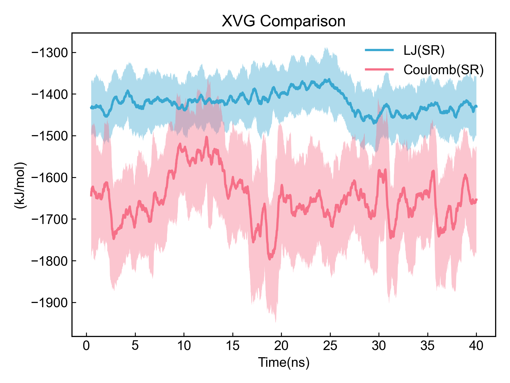

```bash
dit xvg_compare -f energy.xvg -c 1,3 -l "LJ(SR)" "Coulomb(SR)" -xs 0.001 -x "Time(ns)" -smv -eg plotly
```

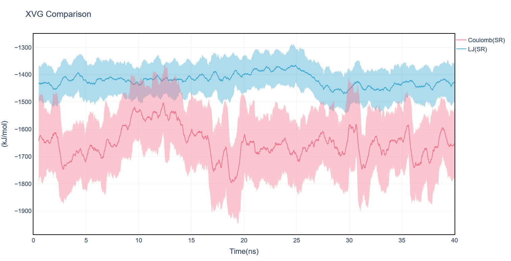

```bash
dit xvg_compare -f energy.xvg -c 1,3 -l "LJ(SR)" "Coulomb(SR)" -xs 0.001 -x "Time(ns)" -smv -eg gnuplot
```

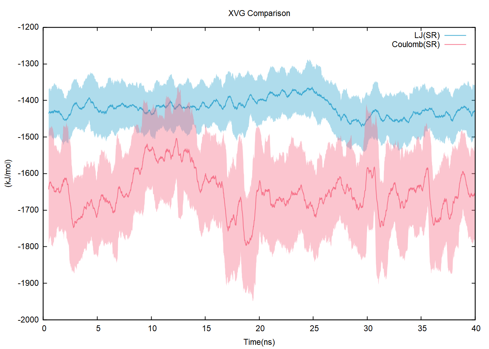

To export data to CSV:

```bash
dit xvg_compare -f energy.xvg -c 1,3 -l "LJ(SR)" "Coulomb(SR)" -xs 0.001 -x "Time(ns)" -ns -csv data.csv
```


### xvg_ave

Calculate average, standard deviation, and standard error for each column in xvg data.

```bash
$ dit xvg_ave -f rmsd.xvg -b 1000 -e 2001

>>>>>>>>>>>>>>                    rmsd.xvg                    <<<<<<<<<<<<<<
----------------------------------------------------------------------------
|                  |     Average      |     Std.Dev      |     Std.Err      |
----------------------------------------------------------------------------
|    Time (ps)     |   15000.000000   |   2891.081113    |    91.378334     |
----------------------------------------------------------------------------
|    RMSD (nm)     |     0.388980     |     0.038187     |     0.001207     |
----------------------------------------------------------------------------
```


### xvg_show_distribution

Display data distribution. Default shows distribution histogram. Use `-m pdf` for Kernel Density Estimation or `-m cdf` for Cumulative Kernel Density Estimation.

```bash
dit xvg_show_distribution -f gyrate.xvg -c 1,2 
```

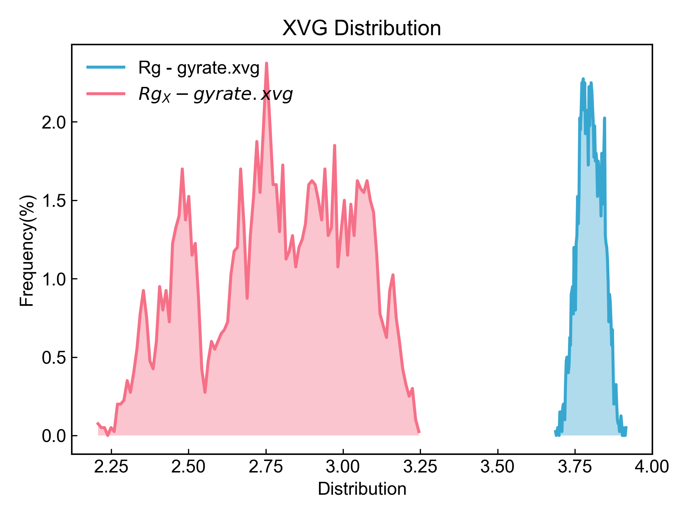

```bash
dit xvg_show_distribution -f gyrate.xvg -c 1,2 -m pdf -eg plotly
```

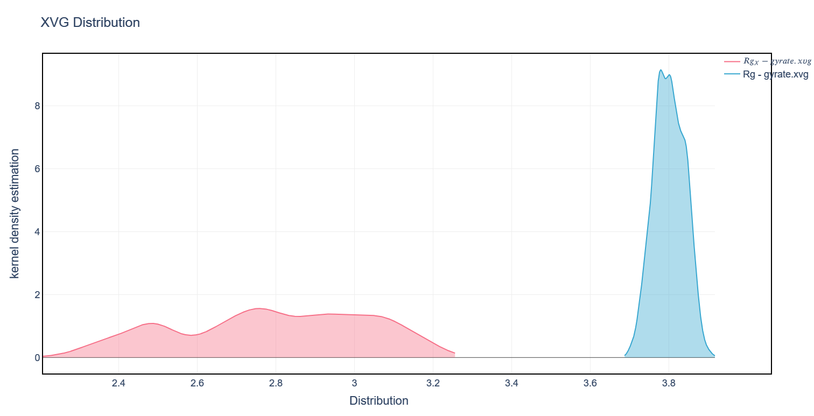

```bash
dit xvg_show_distribution -f gyrate.xvg -c 1,2 -m cdf -eg gnuplot
```

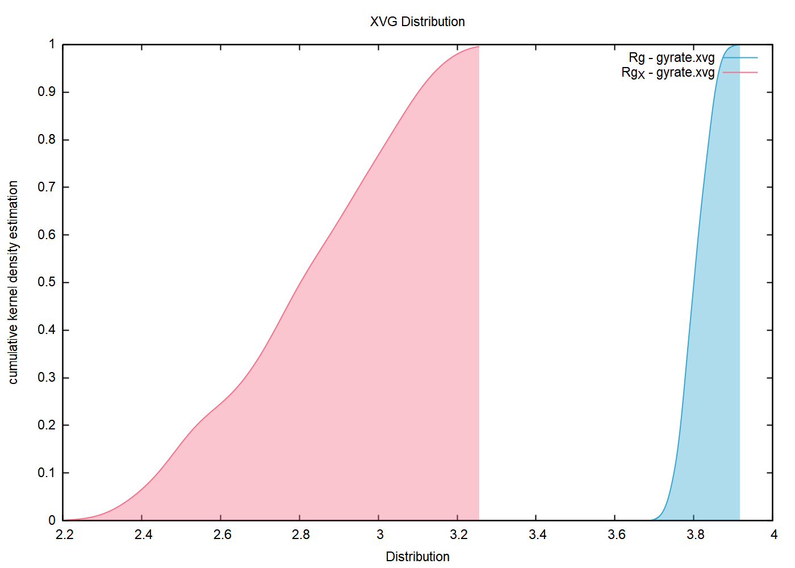


### xvg_show_stack

Create stacked area plots for selected data columns.

```bash
dit xvg_show_stack -f dssp_sc.xvg -c 2-7 -xs 0.001 -x "Time (ns)"
```

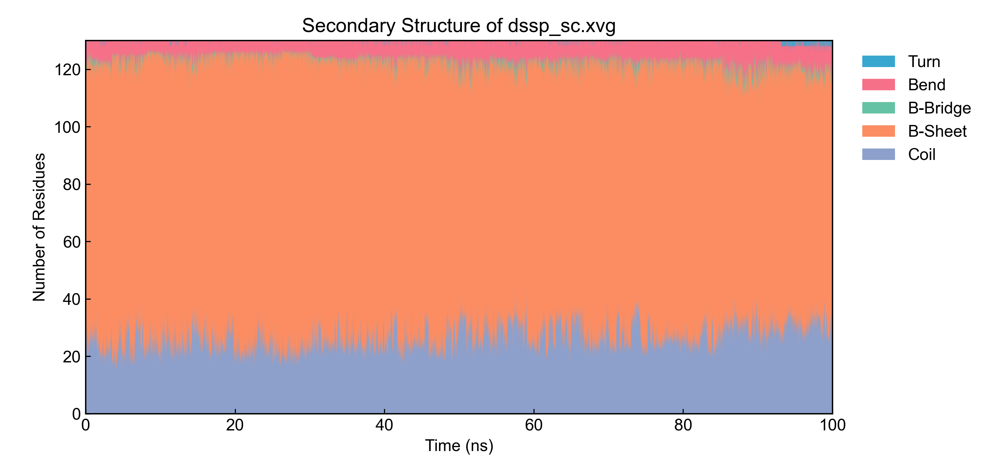


### xvg_show_scatter

Create scatter plots from two or three columns (third column for color mapping).

```bash
dit xvg_show_scatter -f gyrate.xvg -c 1,2,0 -zs 0.001 -z "Time(ns)" -eg plotly --x_precision 2 --y_precision 2
```

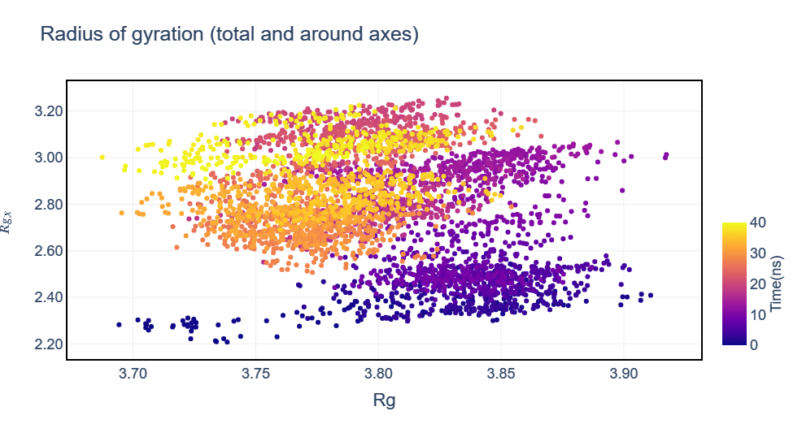

Note: Although column 0 (time) is selected, in scatter plots it's used for color mapping (third dimension), so adjustments use `-zs 0.001 -z Time(ns)`.


### xvg_energy_compute

Calculate intermolecular interaction energies using the interaction principle: Interaction Energy = Complex Energy - Molecule A Energy - Molecule B Energy.

Input three files: complex energy, molecule A energy, molecule B energy. Each file should contain exactly five columns (time, LJ(SR), Disper.corr., Coulomb(SR), Coul.recip.) in order.

```bash
dit xvg_energy_compute -f prolig.xvg pro.xvg lig.xvg -o results.xvg
```

Note: For more accurate results, consider using energy groups with extended cutoff in a rerun simulation.


### xvg_box_compare

Compare data using violin and scatter plots. Similar to `xvg_compare` but with different visualization.

```bash
dit xvg_box_compare -f gyrate.xvg -c 1,2,3,4 -l Gyrate Gx Gy Gz -z "Time(ns)" -zs 0.001
```

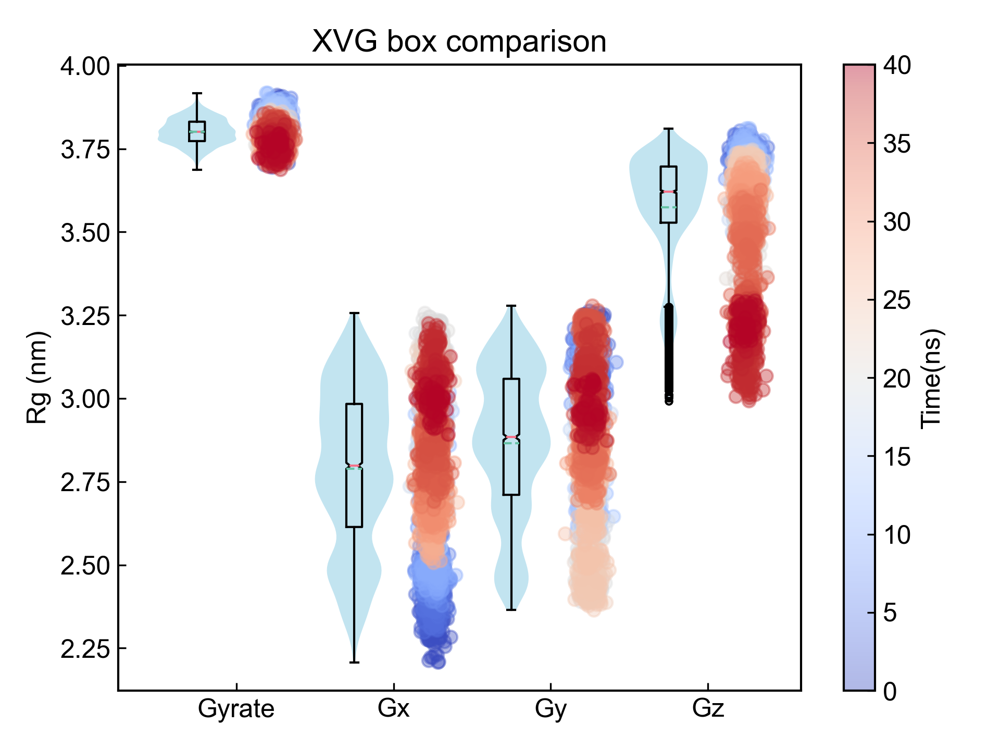

```bash
dit xvg_box_compare -f gyrate.xvg -c 1,2,3,4 -l Gyrate Gx Gy Gz -z "Time(ns)" -zs 0.001 -eg plotly
```

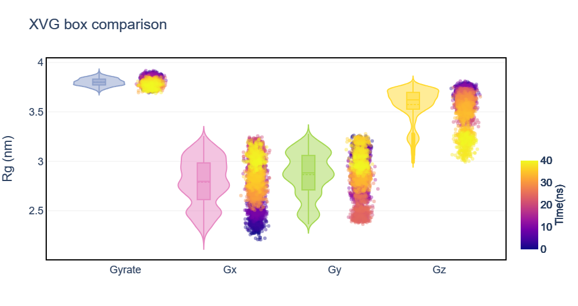

```bash
dit xvg_box_compare -f gyrate.xvg -c 1,2,3,4 -l Gyrate Gx Gy Gz -z "Time(ns)" -zs 0.001 -eg gnuplot -ymin 2
```

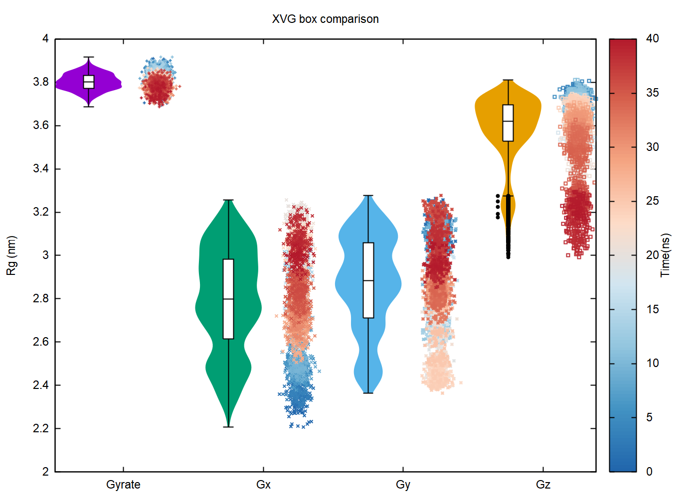

Hide scatter plots with `-m withoutScatter`:

```bash
dit xvg_box_compare -f gyrate.xvg -c 1,2,3,4 -l Gyrate Gx Gy Gz -z "Time(ns)" -zs 0.001 -m withoutScatter 
```

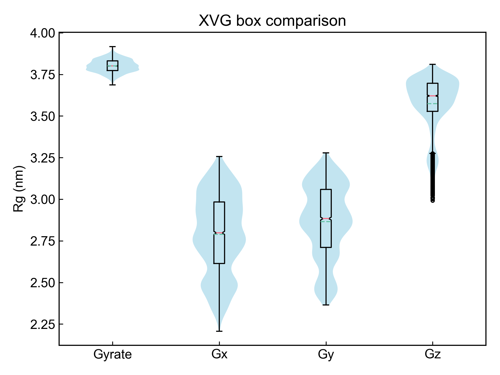


### xvg_combine

Read data from multiple xvg files and combine them into a new xvg file.

```bash
dit xvg_combine -f RMSD.xvg Gyrate.xvg -c 0,1 1 -l RMSD Gyrate -x "Time(ps)"
```


### xvg_ave_bar

Scenario: You simulated three different ligands with a protein, each with three parallel simulations (9 trajectories total). You have 9 xvg files of hydrogen bonds over time. You want to calculate average hydrogen bonds for the stable period, then compare between systems.

This command calculates averages for each file, then computes mean and error for parallel simulations within each system.

```bash
dit xvg_ave_bar -f bar_0_0.xvg,bar_0_1.xvg bar_1_0.xvg,bar_1_1.xvg -c 1,2 -l MD_0 MD_1 -al Hbond Pair -csv hhh.csv -y Number
```

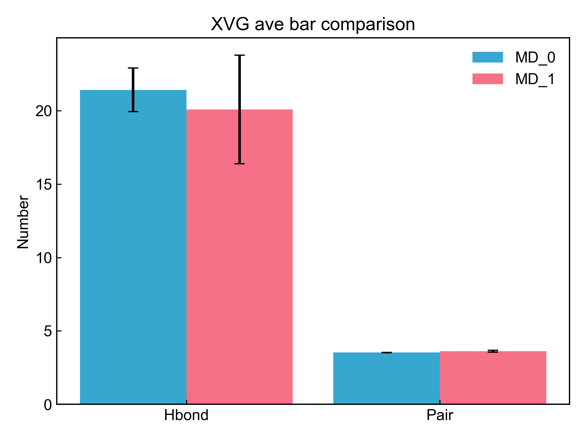

`-al` sets X-axis labels, `-csv` exports calculated data.


### xvg_rama

Convert phi/psi dihedral angle data from `gmx rama` to Ramachandran plot.

```bash
dit xvg_rama -f rama.xvg
```

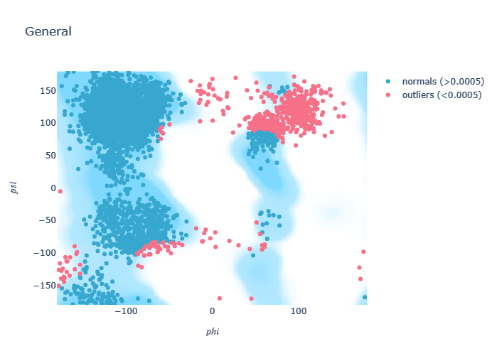


### xpm_show

Visualize xpm files with four plotting engines (matplotlib, plotly, gnuplot, plotext) and four modes (imshow, pcolormesh, 3d, contour).

For **Discrete** type xpm files, matplotlib's imshow and plotly/gnuplot's pcolormesh use original xpm colors. For **Continuous** type, colormap is applied. Colormap can be set via command line or style files.

Interpolation is available. For matplotlib's imshow, uses built-in interpolation. For other modes, uses scipy's interp2d with `-ipf` for fold setting.

Use `-xmin`, `-xmax`, `-ymin`, `-ymax` to crop the matrix by pixel index.

```bash
dit xpm_show -f DSSP.xpm -xmin 1000 -xmax 2001
```

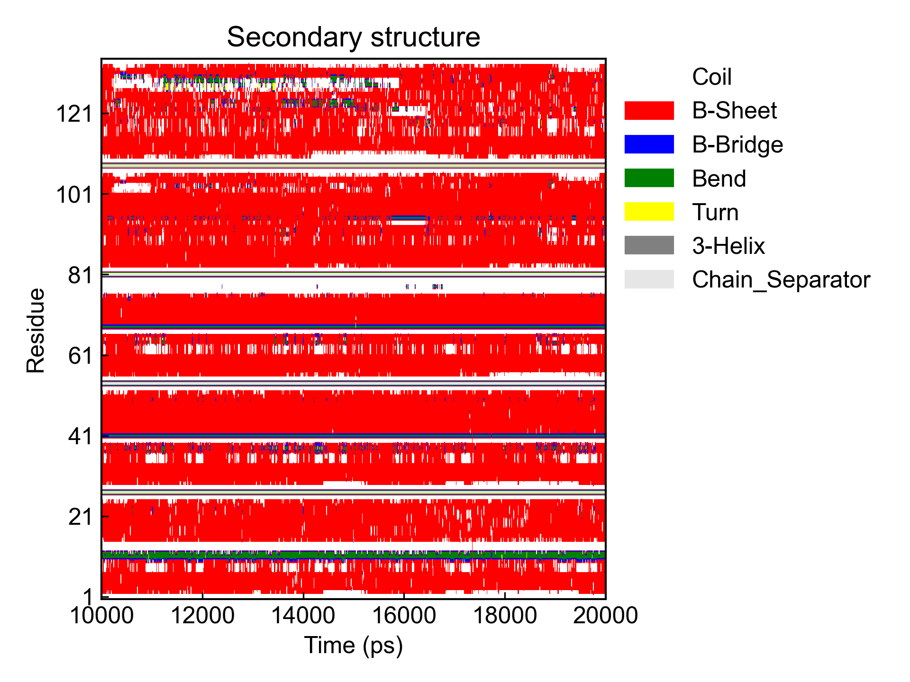

```bash
dit xpm_show -f fel.xpm
```

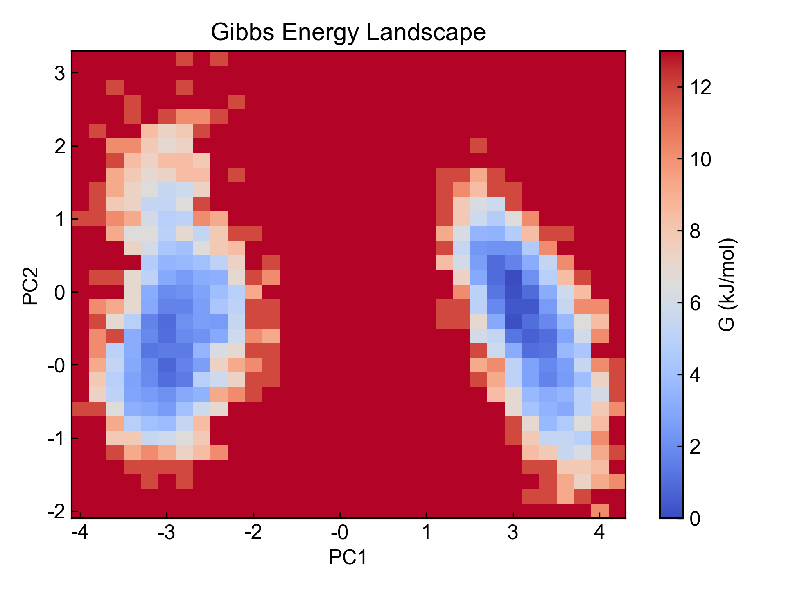

```bash
dit xpm_show -f fel.xpm -cmap Blues_r -ip bilinear
```

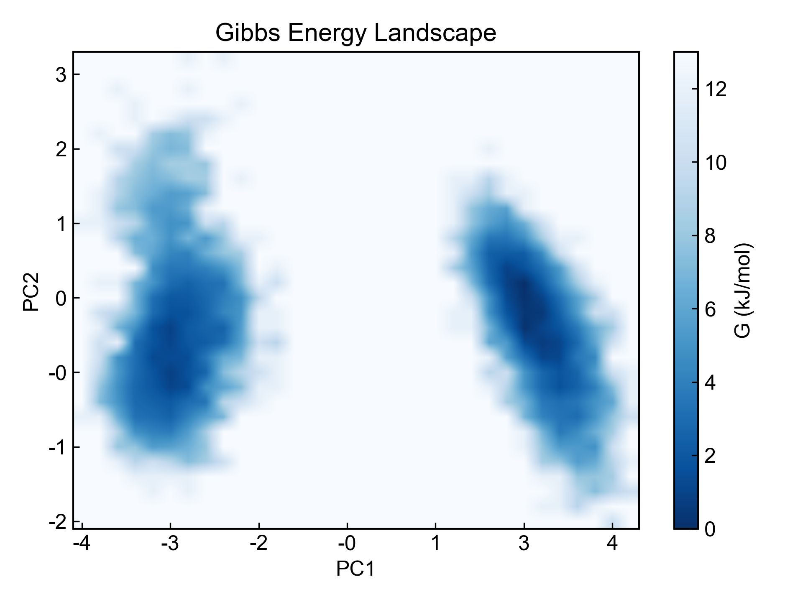

```bash
dit xpm_show -f fel.xpm -m pcolormesh -ip linear -ipf 5 -cmap Greys_r
```

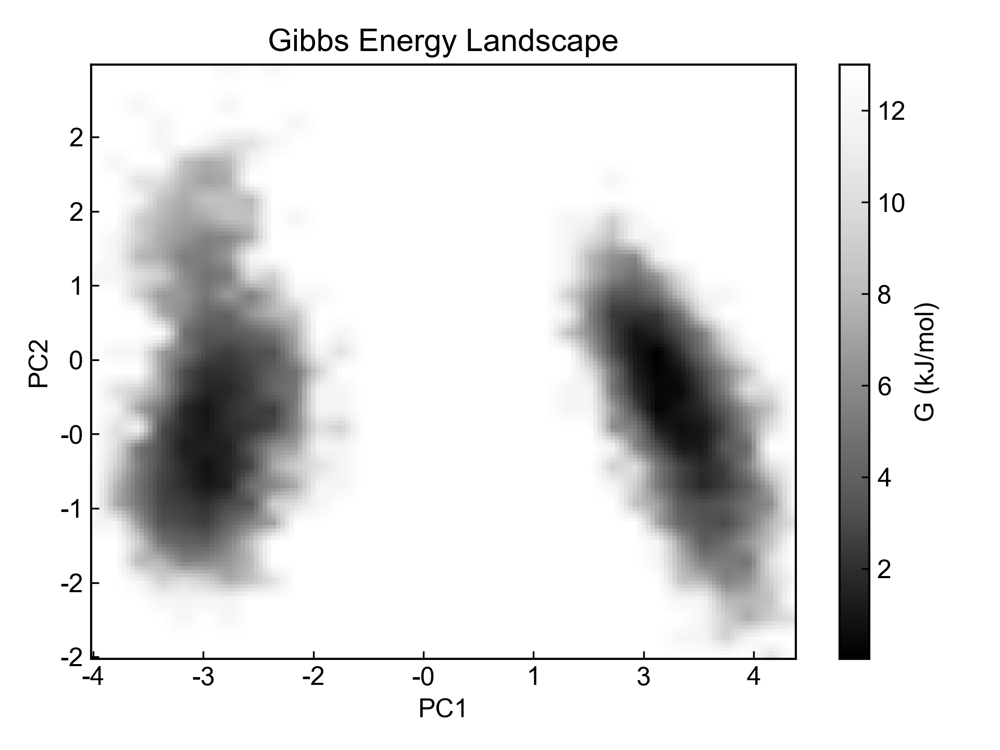

```bash
dit xpm_show -f fel.xpm -m 3d --x_precision 1 --y_precision 2 --z_precision 0 -cmap summer --colorbar_location bottom 
```

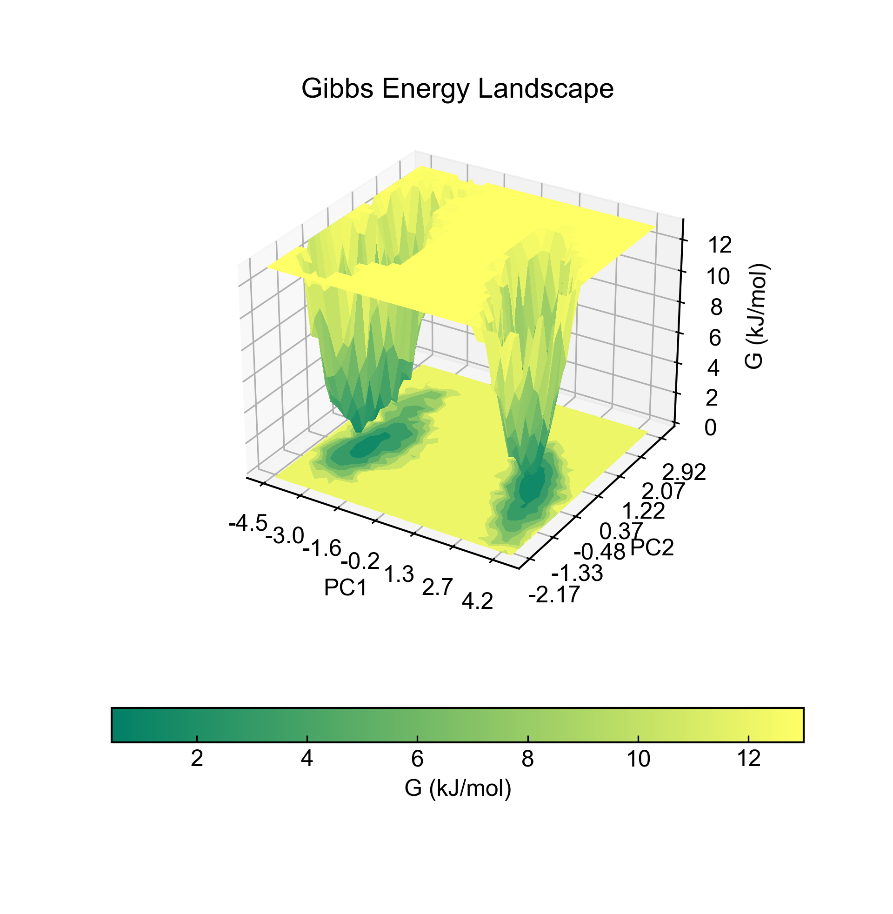

```bash
dit xpm_show -f fel.xpm -m contour -cmap jet 
```

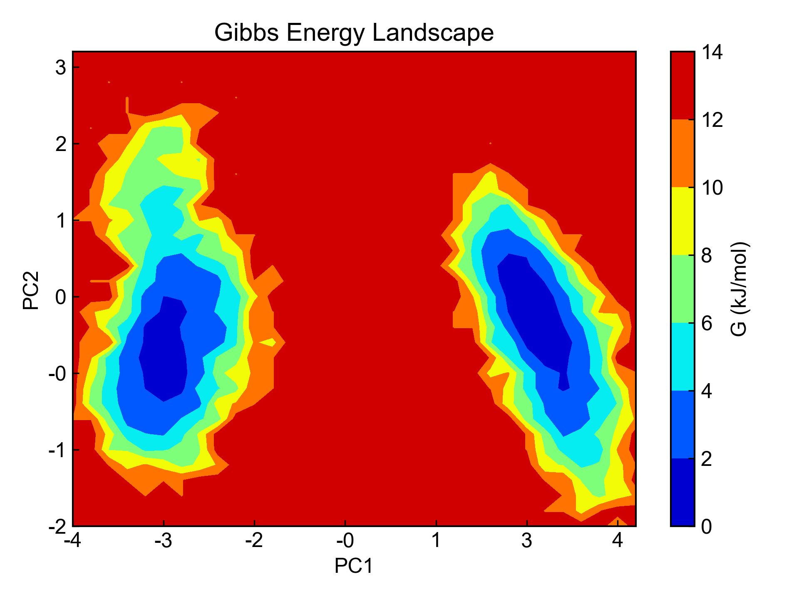

```bash
dit xpm_show -f fel.xpm -eg plotly -m 3d -cmap spectral
```

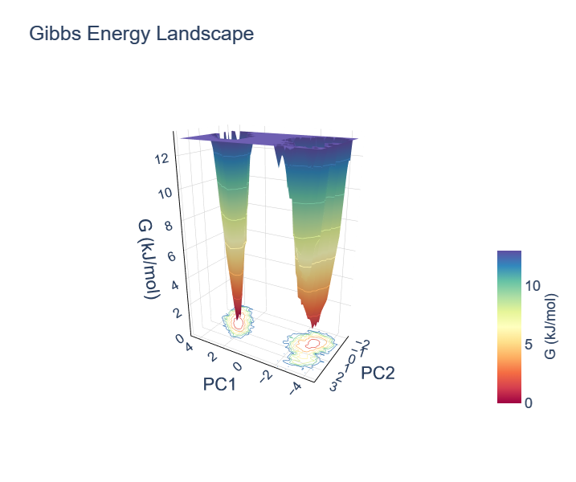

```bash
dit xpm_show -f fel.xpm -eg gnuplot -m 3d
```

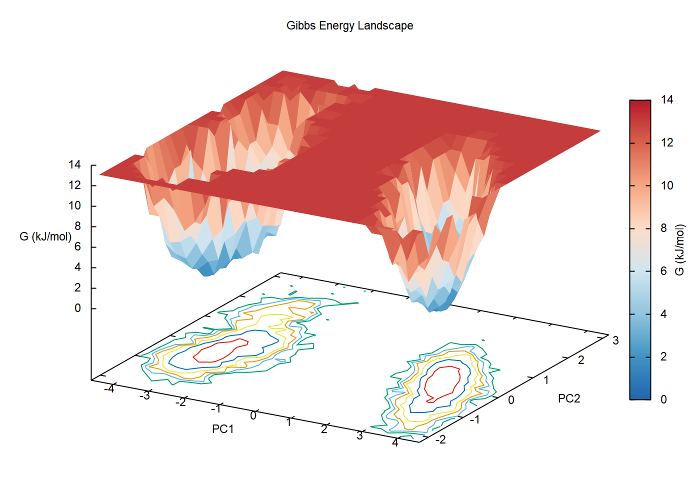

Since v0.6.0, custom tick count is supported:

```bash
dit xpm_show -f dccm.xpm --x_numticks 5 --y_numticks 5 --z_numticks 5 -zmin -1
```


### xpm2csv

Convert xpm data to CSV format (X, Y, Z).

```bash
dit xpm2csv -f fel.xpm -o fel.csv
```


### xpm2dat

Convert xpm data to M*N matrix format.

```bash
dit xpm2dat -f fel.xpm -o fel.dat
```


### xpm_diff

Calculate the difference between two xpm files of the same size and physical meaning. Useful for comparing DCCM or DSSP changes.

```bash
dit xpm_diff -f DCCM0.xpm DCCM1.xpm -o DCCM0-1.xpm
```


### xpm_merge

Merge two xpm files diagonally (half and half). Useful for symmetric matrices where you want to show two different matrices side by side.

```bash
dit xpm_merge -f DCCM0.xpm DCCM1.xpm -o DCCM0-1.xpm
```


### mdp_gen

Generate GROMACS mdp template files for common simulation types.

```bash
dit mdp_gen 
dit mdp_gen -o nvt.mdp
```


### show_style

Generate style control files for different plotting engines. Place customized files in the current directory and DIT will load them automatically.

```bash
dit show_style
dit show_style -eg plotly
dit show_style -eg gnuplot 
dit show_style -eg plotly -o DIT_plotly.json
```


### find_center

Find the geometric center of atom groups in gro files.

```bash
dit find_center -f test.gro
dit find_center -f test.gro index.ndx
dit find_center -f test.gro index.ndx -m AllAtoms
```

`-m AllAtoms` searches for the nearest atom to the center from all atoms, not just the specified group.


### dccm_ascii

Convert covariance matrix ASCII output from `gmx covar` to dynamic cross-correlation matrix (DCCM) xpm file.

```bash
dit dccm_ascii -f covar.dat -o dccm.xpm
```


### dssp

Read the dat file from GROMACS 2023's `dssp` command and convert it to the xpm and sc.xvg format from GROMACS 2022 and earlier versions.

```bash
dit dssp -f dssp.dat -o dssp.xpm
dit dssp -f dssp.dat -c 1-42,1-42,1-42 -b 1000 -e 2001 -dt 10 -x "Time (ps)"
```


### ndx_add

Add a new group to GROMACS index file.

```bash
dit ndx_add -f index.ndx -o test.ndx -al lig -c 1-10
dit ndx_add -al lig mol -c 1-10-3,11-21 21-42
```


### ndx_split

Split an index group evenly into multiple groups.

```bash
dit ndx_split -f index.ndx -al 1 2
dit ndx_split -f index.ndx -al Protein 2
dit ndx_split -f index.ndx -al Protein 2 -o test.ndx
```


## Plotting Styles

Each plotting engine has independent style control. Use `dit show_style` to get default style files, modify them, and place in the current directory for DIT to load.

### matplotlib

matplotlib uses mplstyle files for style control. Reference: https://matplotlib.org/stable/tutorials/introductory/customizing.html#the-matplotlibrc-file

Default DIT mplstyle:

```bash
## Matplotlib style for DuIvyTools
axes.labelsize:     12
axes.linewidth:     1
xtick.labelsize:    12
ytick.labelsize:    12
ytick.left:         True
ytick.direction:    in
xtick.bottom:       True
xtick.direction:    in
lines.linewidth:    2
legend.fontsize:    12
legend.loc:         best
legend.fancybox:    False
legend.frameon:     False
font.family:        Arial
font.size:          12
image.cmap:         coolwarm
image.aspect:       auto
figure.dpi:         100
savefig.dpi:        300
axes.prop_cycle:    cycler('color', ['38A7D0', 'F67088', '66C2A5', 'FC8D62', '8DA0CB', 'E78AC3', 'A6D854', 'FFD92F', 'E5C494', 'B3B3B3', '66C2A5', 'FC8D62'])
```

Key parameters:
- `legend.loc`: Legend position when `--legend_location` is default
- `axes.prop_cycle`: Color cycle for line plots


### plotly

plotly offers extensive customization through JSON template files. Almost all visual elements can be modified.

Resources:
- https://plotly.com/python/reference/index/
- https://github.com/AnnMarieW/dash-bootstrap-templates/tree/main/src/dash_bootstrap_templates/templates

Template structure:
```json
{
  "data": {
    "contour": [...]
  },
  "layout": {
    "legend": {...},
    "colorway": [...],
    "xaxis": {...},
    "yaxis": {...},
    "scene": {...}
  }
}
```

Key parameters:
- `legend`: Legend position and style
- `colorway`: Color cycle for plots
- `xaxis`, `yaxis`: Axis styling
- `scene`: 3D plot axis styling


### gnuplot

Gnuplot is a classic scientific plotting tool. All customization is done through input scripts.

Default DIT gnuplot style:
```gnuplot
# define line styles
set style line 1 lt 1 lc rgb "#38A7D0"
set style line 2 lt 1 lc rgb "#F67088"
...
# define palette
set palette defined ( 0 '#2166AC', 1 '#4393C3', 2 '#92C5DE', ...)

set term pngcairo enhanced truecolor font "Arial, 14" fontscale 1 linewidth 2 pointscale 1 size 1400,1000
```

Resources:
- https://github.com/hesstobi/Gnuplot-Templates
- https://github.com/Gnuplotting/gnuplot-palettes


### plotext

Terminal-based plotting with limited customization. Best for quick previews.


## Program Modules

DIT v0.5.0+ has improved modularity:

**File Parsers**

Support for xvg, xpm, ndx, mdp, pdb, and gro files:

```python
from DuIvyTools.DuIvyTools.FileParser import xvgParser, xpmParser, groParser, pdbParser, ndxParser, mdpParser
```

**Visualization Engines**

Four plotting engines for line, scatter, heatmap, and other plot types:

```python
from DuIvyTools.DuIvyTools.Visualizer import Visualizer_matplotlib
```

**Command Modules**

Each command is a class handling command logic and calling visualization modules. Direct API usage requires constructing parameter objects.


## Cite DuIvyTools

> DuIvyTools is open-source under GPLv3 license and has obtained software copyright.
>
> Free to use and modify for academic and personal purposes. **Commercial use is prohibited.**

Cite DuIvyTools by:

[](https://doi.org/10.5281/zenodo.6339993)


## Reward

A lot of time and effort has been spent developing DuIvyTools. If you find it useful, consider supporting its continued development.


